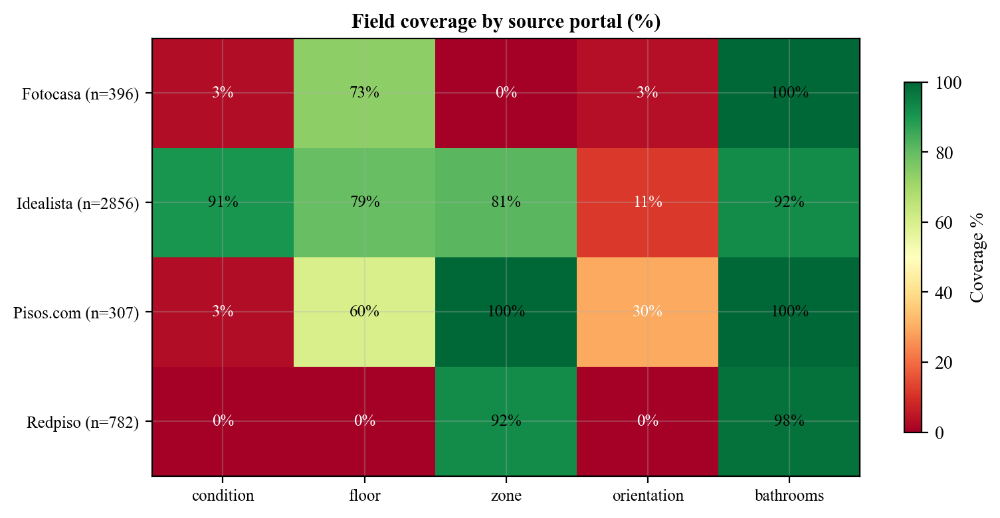
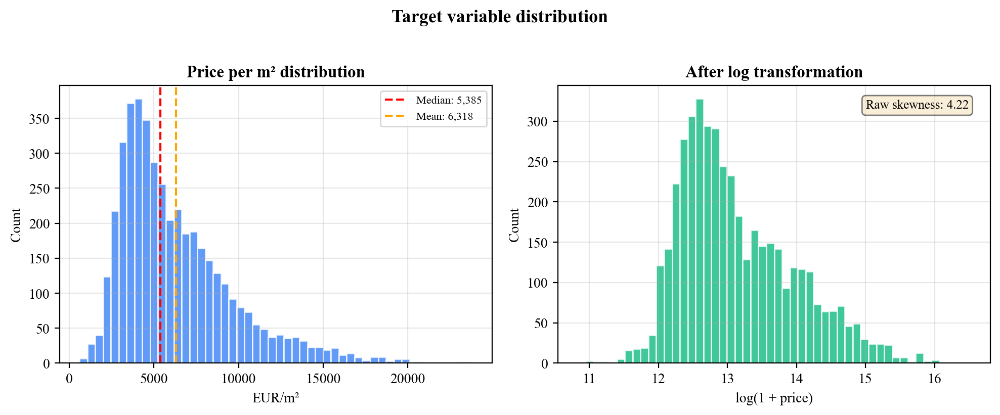
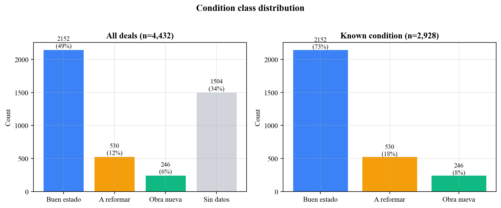
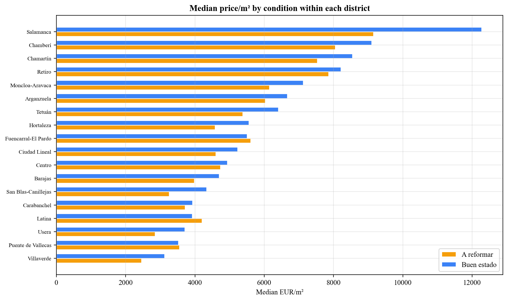
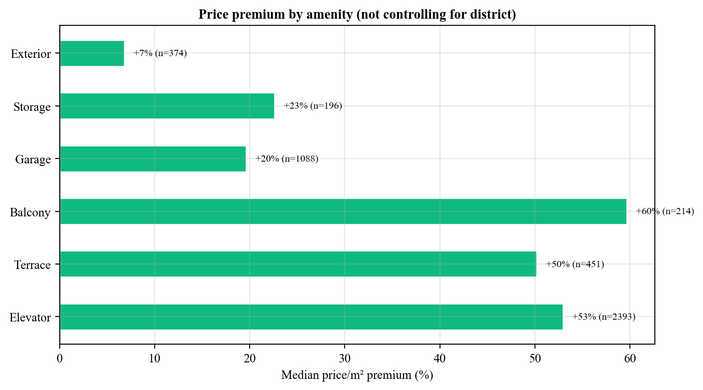

# CapReSol: Automated Real Estate Investment Analysis for Madrid

## Data Collection, Machine Learning Valuation, and Financial Modeling

# Automated Real Estate Investment Analysis in Madrid

## M. Attie

## IE University

# Author Note

[First paragraph: Complete departmental and institutional affiliation]

[Second paragraph: Acknowledgments and special circumstances]

[Third paragraph: Contact information, mailing address and e-mail]

#

# Abstract

This thesis presents CapReSol, a system that automates the real estate investment analysis pipeline for Madrid. The system collects property listings from five Spanish portals (Idealista, Redpiso, Fotocasa, Pisos.com) through APIs and web scraping, normalizes them into a unified database, and applies a Gradient Boosting regression model to predict market prices. It also integrates official notary closing price data from the Colegio General del Notariado for 55 Madrid postal codes, allowing direct comparison between what sellers ask and what buyers actually pay. A separate financial module lets users evaluate Fix and Flip investment opportunities by computing IRR, MOIC, ROE, and gross margin from monthly equity cash flows with leverage. An analytics dashboard then ties everything together, comparing asking prices against closing prices and ML predictions across Madrid's 21 districts to surface where the best opportunities are. The Gradient Boosting model, selected after comparing four algorithms on 4,425 listings, achieves an R-squared of 0.88 on five-fold cross-validation. No existing system, academic or commercial, combines multi-source scraping, ML valuation, notary transaction data, financial modeling, and opportunity analytics in a single deployed platform for the Spanish market. The system runs in production on Railway and Vercel with multi-user authentication, and was reviewed by five real estate professionals from Argentina and Spain.

*Keywords:* real estate, machine learning, property valuation, web scraping, investment analysis, Madrid, gradient boosting, fix and flip, automated valuation model

#

#

# CapReSol: Automated Real Estate Investment Analysis for Madrid

## Background and context

In 2024, real estate investment in Spain reached approximately 14 billion euros, with Madrid accounting for 31 percent of the total volume (CBRE, 2024). Investment funds and private investors, including family offices, made up nearly a third of total investment activity. Residential assets alone amounted to 4.3 billion euros.

At the same time, new housing construction has not kept pace with demand. The number of new units created per household has been declining since 2018, reaching its lowest level since 2014 in 2023 (BBVA Research, 2024). Fewer new units mean fewer opportunities, and in a market that tight, being able to find and evaluate deals quickly matters.

Yet the tools most investment professionals use do not match the pace of the market. Property listings sit on five or more portals, each with its own data format and access method. An analyst looking for renovation opportunities across Madrid must visit each portal separately, compare listings by hand, and maintain spreadsheets to track what has been reviewed. According to the 2025 European PropTech report, 62 percent of real estate professionals find it difficult to identify the right technology tool, citing a fragmented market with too many options that rarely cover the full workflow (Maps PropTech API, 2025). When asked which processes need the most help, 47 percent chose automation, doubling from the previous year.

Europe now hosts 50 percent of PropTech companies worldwide, with particular activity in countries with high housing demand like Spain (European PropTech Report, 2025). Most commonly adopted technologies are valuation and reporting tools (64%), automation tools (28%), and platforms (24%). But adoption has not meant satisfaction. Cost remains the primary barrier at 60 percent, followed by lack of information at 45 percent. Still, 80 percent of respondents say technology improved their processes, and 41 percent consider spending between 150 and 400 euros per month on technology acceptable (Maps PropTech API, 2025). The issue is not willingness to pay. It is perceived value.

## Problem statement

Investment professionals in Madrid face three problems that compound each other:

The first is data fragmentation. Listings are spread across Idealista, Fotocasa, Pisos.com, Redpiso, and others. Each uses different data schemas, different access methods, and different levels of completeness. There is no standard way to pull them into a single, filterable dataset.

The second is valuation opacity. Without a systematic method for estimating what a property is worth, professionals rely on intuition and manual comparison of similar listings. Automated Valuation Models exist, but they tend to be proprietary, expensive, and built for institutional lenders rather than the kind of deal-by-deal analysis that a fund or individual investor needs.

The third is an analytical gap. Even when data is collected and a rough valuation is formed, there is no system that connects the pipeline from deal sourcing through financial analysis. Investment decisions require computing metrics like IRR and ROE under specific renovation and financing assumptions. Today that analysis happens in disconnected Excel spreadsheets. There is also no integrated way to compare asking prices against official notary closing prices to check negotiation margins.

These three problems feed into each other. Fragmented data makes it harder to build a valuation model. Without systematic valuation, financial projections rely on guesswork. And without a single platform, every step of the analysis requires switching between tools.

## Main contribution

CapReSol is a working, deployed system that covers the full real estate investment pipeline in one application: from raw portal data to financial decision metrics. What makes it different from existing work is the integration. Multi-source web scraping, ML valuation, official notary closing prices, Fix and Flip financial modeling with leverage, and an analytics dashboard designed to find opportunities. Each of these components exists separately elsewhere. Nowhere are they connected for a specific market.

The system is not a prototype. It runs in production with over 4,400 listings from five portals, a Gradient Boosting model with R-squared of 0.88 on cross-validation, notary data from 55 postal codes, and six authenticated users.

## Objectives

The primary objective is to design, build, and deploy a system that automates the full real estate investment analysis pipeline for Madrid's residential market.

Six specific goals support this:

1. Automate the collection of property listings from five sources into a unified PostgreSQL database.
2. Build and evaluate a machine learning model that predicts property prices from physical and locational features.
3. Integrate official notary closing price data to benchmark asking prices against real transaction values.
4. Implement a Fix and Flip financial model with IRR, MOIC, ROE, and gross margin computation.
5. Build an analytics dashboard that identifies district-level investment opportunities.
6. Deploy the system as a secure, multi-user web application.

## Thesis organization

The thesis proceeds as follows. Chapter 2 reviews the literature on PropTech, ML for valuation, Fix and Flip as an investment strategy, and the competitive landscape. Chapter 3 covers the methodology: research approach, technology choices, data sources, and the collection pipeline. Chapter 4 presents an exploratory data analysis of the collected dataset. Chapter 5 describes the ML valuation model, including feature engineering, model comparison, and experiment results. Chapter 6 explains the financial analysis module. Chapter 7 describes the analytics dashboard. Chapter 8 reports results, professional feedback, and discusses limitations. Chapter 9 offers conclusions and future directions.

# Literature review

## PropTech and real estate technology

PropTech refers to digital tools applied across the real estate lifecycle: search, acquisition, management, and disposition. The category covers everything from marketplace platforms to valuation tools to investment analysis software.

In Europe, PropTech has grown to represent roughly half of all companies in the sector worldwide, with particular concentration in countries with high housing demand (European PropTech Report, 2025). Spain is among the most active markets in Southern Europe. Spanish real estate companies are increasingly using AI, smart data tools, and digital marketplaces to find opportunities and improve operations (PwC, 2025).

The business model distribution leans toward enterprise clients: 60 percent of PropTech companies operate in B2B or B2B2C models, while 40 percent target consumers directly. Among B2B solutions, 28 companies focus on valuation and 135 on internal operations (Maps PropTech API, 2025).

Despite the growth, the industry appears to be entering a consolidation phase. Adoption has already happened for most firms. The focus now is on making existing tools work, not adding more (Maps PropTech API, 2025).

## Automated data collection in real estate

Collecting property data from multiple online sources involves two main approaches: structured API access and web scraping.

Structured APIs, like the one Idealista provides, return data in standardized JSON with defined fields, pagination, and authentication. The advantage is data quality; the limitation is rate limits. Idealista caps requests at 100 per month.

Web scraping extracts data from rendered HTML pages. Modern portals often use JavaScript frameworks to render content in the browser, which means traditional HTTP scrapers see empty pages. Services like Firecrawl handle this by rendering pages through headless browsers and returning clean markdown. This is how portals like Fotocasa and Pisos.com can be accessed programmatically.

The main challenge in multi-source collection is schema heterogeneity. Each portal names fields differently and has different levels of completeness. A three-bedroom apartment on Idealista has structured fields for bedrooms, bathrooms, and floor. The same listing on Fotocasa may bury those details inside a text description. Deduplication across portals is best done by matching on listing URL, since each portal assigns unique URLs.

The Extract, Transform, Load (ETL) pattern governs this type of pipeline. Raw data is extracted from heterogeneous sources, transformed into a canonical schema through parsing and normalization, and loaded into a relational database.

## Machine learning for property valuation

Hedonic pricing models, formalized by Rosen (1974), decompose a property's price into the implicit value of its characteristics: location, size, rooms, condition, and amenities. These models traditionally use linear regression, which is interpretable but assumes linearity.

More recent work applies machine learning methods that handle non-linear relationships. Decision trees partition the feature space recursively. Random forests aggregate many trees to reduce variance. Gradient Boosting builds trees sequentially, with each new tree correcting the errors of the previous ensemble. XGBoost and LightGBM are optimized implementations of gradient boosting that have dominated applied ML research on structured data.

For property price prediction specifically, Baldominos, Saez, and Quintana (2018) applied ensemble methods to Spanish housing data and found that gradient boosting outperformed linear regression and random forests on MAE and RMSE. Kok, Kopczuk, and Timmins (2017) demonstrated the value of large-scale property data combined with machine learning for valuation at scale.

Model evaluation uses standard regression metrics. R-squared measures how much variance the model explains. MAE gives the average prediction error in euros. RMSE penalizes large errors more. MAPE normalizes errors by the actual value, useful for comparing across price ranges. Cross-validation, typically five or ten folds, estimates generalization by training and testing on different partitions.

## Fix and Flip as an investment strategy

The Fix and Flip strategy involves purchasing a property in need of renovation, improving it, and selling at a higher price. In residential real estate, this works best in markets where three conditions come together: limited new construction supply, a large stock of older properties that can be upgraded, and legal or practical constraints that make ground-up development difficult.

Madrid fits all three. New housing construction has been declining since 2018 (BBVA Research, 2024). The city center, particularly districts like Centro, Salamanca, and Chamberi, is full of pre-war buildings that cannot be demolished or replaced due to heritage protections. The urban plan restricts new development in the most desirable areas. When you cannot build new, renovation is the most viable path to creating value. This is why Fix and Flip has become one of the most common active investment strategies in Madrid's residential market.

The primary metric for evaluating a flip is the Internal Rate of Return (IRR), the discount rate at which the net present value of all cash flows equals zero. For projects measured in months, IRR is computed from monthly cash flows and annualized. Complementary metrics include MOIC (total cash returned divided by equity invested), ROE (profit divided by maximum equity exposure), and Gross Margin (profit divided by total development cost).

Leverage amplifies both returns and risk. A mortgage covering part of the purchase price reduces equity needed upfront, increasing IRR when profitable. But interest payments reduce absolute profit. Financial models must account for the monthly cost of acquisition debt and renovation debt, typically modeled as interest-only during the hold period with principal repaid at exit.

## Notary and transaction data

Spain's notary system, administered by the Colegio General del Notariado, records the closing price of every real estate transaction. These prices differ from what portals publish. The gap between asking and closing is the negotiation margin, and knowing it by district is valuable intelligence for any investor.

The Colegio General del Notariado publishes aggregated data through a public API at penotariado.com. For each postal code, the data includes average price per square meter at closing, average total transaction price, average surface area, and transaction counts. These can be filtered by construction type (new, second-hand, or all) and property class (apartments, houses, or all), yielding nine filter combinations.

This data is useful because it represents what buyers actually pay, not what sellers hope for. Comparing portal asking prices against notary closing prices by district shows where the largest negotiation margins exist.

## Existing solutions and competitive landscape

Most existing tools address one piece of the investment pipeline. Automated Valuation Models focus on price prediction. Portal aggregators focus on search. Financial modeling tools focus on returns. Dashboard products focus on visualization.

In the Spanish market specifically, Aura (luci.aura-app.es) is a consumer-facing search aggregator that lets users search across multiple portals using natural language queries. It connects users with financing and legal professionals. But it targets homebuyers, not investors, and offers no ML valuation, no financial modeling, and no analytics for investment decision making.

Internationally, six commercial competitors were analyzed:

| Capability | Aura | IntellCRE | HouseCanary | Cherre | CoreLogic | CapReSol |
| :---- | :---- | :---- | :---- | :---- | :---- | :---- |
| Multi-source scraping | Yes | No | No | Partial | No | Yes |
| ML valuation | No | Yes | Yes | No | Yes | Yes |
| Notary/transaction data | No | No | Yes | Partial | Yes | Yes |
| Financial modeling | No | Partial | No | No | No | Yes |
| Analytics dashboard | No | Partial | Yes | Yes | Yes | Yes |
| Spain / Madrid | Yes | No | No | No | No | Yes |

*Table 1.* Capabilities of existing solutions compared to CapReSol.

No published system combines multi-source scraping, ML valuation, official notary data, financial modeling with leverage, and opportunity analytics in a single application. The international competitors (HouseCanary, CoreLogic) operate only in the United States. Aura operates in Spain but targets a different user and a different problem.

Ninety-two percent of firms report piloting AI tools, but only 5 percent have achieved their stated goals, largely because of legacy infrastructure and fragmented data ingestion (v7 Labs, 2026). Most existing solutions handle the analysis stage but skip the messy work of collecting and normalizing data from unstructured sources. That ingestion problem is where CapReSol starts.

# Methodology

## Research approach

This thesis follows a Design Science Research methodology. The contribution is a software artifact built to solve a concrete problem. Evaluation uses quantitative metrics (ML model performance, dataset coverage) and qualitative feedback from five real estate professionals.

Development was iterative: database schema first, then data collection, then ML, then financial modeling, then analytics, then authentication and deployment. Each component was tested against production data before moving to the next.

## Technology selection

| Layer | Technology |
| :---- | :---- |
| Backend | FastAPI (Python), Uvicorn, SQLAlchemy + Alembic |
| Database | PostgreSQL 16 (ACID, upsert, UUID PKs) |
| Frontend | Next.js 14, Tailwind CSS, Recharts |
| ML | scikit-learn, XGBoost, joblib, numpy-financial |
| Deployment | Railway (Docker + managed Postgres), Vercel (CDN) |

*Table 2.* Technology stack.

The backend is a single FastAPI service. An earlier design considered a separate Node.js routing layer, but consolidating into Python eliminated inter-service latency and reduced complexity. The system is deployed on Railway (backend Docker container with managed PostgreSQL) and Vercel (frontend), both auto-deploying from the main GitHub branch. Authentication uses JWT tokens with bcrypt-hashed passwords.

## Data sources

| Source | Method | Auth | Volume | Key fields |
| :---- | :---- | :---- | :---- | :---- |
| Idealista API | REST (OAuth2) | Client ID + Secret | ~500/cycle | All structured: price, size, rooms, floor, amenities, condition |
| Idealista HTML | Firecrawl (JS render) | API key | ~15,000 | Regex-parsed: price, size, rooms, condition |
| Redpiso | JSON API | None | ~1,300 | Structured: price, size, rooms, district, broker |
| Fotocasa | Firecrawl (JS render) | API key | ~9,000 | Regex-parsed: price, size, rooms, condition |
| Pisos.com | Firecrawl (JS render) | API key | ~10,500 | Regex-parsed: price, size, rooms, district |
| Notary | ArcGIS FeatureServer | None | 55 postcodes x 9 | Avg price/sqm, avg price, avg surface, transactions |

*Table 3.* Data sources.

## Data collection pipeline

Data enters the system through three scraping strategies. The Idealista API provides structured JSON via OAuth2, rate-limited to 100 requests per month. Redpiso exposes a public JSON endpoint with no authentication. Three portals (Idealista HTML, Fotocasa, Pisos.com) render content through JavaScript, so the system uses Firecrawl to render pages in headless browsers and parses the returned markdown with regex.

Before storage, every listing goes through normalization. District normalization maps approximately 150 barrio name variants to Madrid's 21 canonical districts, using exact lookup first, then partial matching. Postal code extraction uses a regex for five-digit codes starting with 28, with a fallback dictionary mapping 131 barrio names to their postal codes.

Each listing must pass four quality checks: it needs a URL, an asking price, a size in square meters, and a valid Madrid district. Listings missing any of these are dropped. The database uses a URL-based upsert strategy: when a listing URL already exists, fields that might fill gaps (bedrooms, condition, zone) use COALESCE to prefer new non-null values without overwriting existing data, while price is always updated to the latest scraped value.

After each scrape batch, newly inserted deals automatically receive ML predictions, stored with model_version="auto" to distinguish them from manual predictions.

Notary closing price data is collected from the Colegio General del Notariado's public API, which provides postal-code-level transaction statistics. The system scrapes all nine filter combinations (3 construction types x 3 property classes) for postal codes 28001 through 28055.

# Exploratory data analysis

Before building the valuation model, we examined the dataset to understand its structure, completeness, and the relationships between features and price.

## Dataset overview

The production system contains 4,432 property listings across all 21 administrative districts of Madrid, collected from four portal sources.

*Figure 1.* Listings per district. Centro and Salamanca together account for roughly 30 percent of all listings.

*Figure 2.* Dataset by source portal. Idealista dominates at 64%, followed by Redpiso (18%), Fotocasa (10%), and Pisos.com (8%).

## Field completeness and data quality

Not all fields are available from all sources. The heatmap below shows coverage of the fields that matter most for price prediction, broken down by portal.

*Figure 3.* Coverage of price-significant fields by source. Idealista provides the most complete data. Redpiso has zero condition data because their API does not include it. Fotocasa and Pisos.com have partial coverage from Firecrawl parsing.

*Figure 4.* Overall field completeness. Size and district are at 100% because the quality filter requires them. Postal code was originally at 12% but a backfill script that maps zone names to postal codes raised it to 71%. Condition sits at 66%, with the gap coming mainly from Redpiso.

## Price distribution and target transformation

Property prices follow a right-skewed distribution with a skewness of 4.59. The median asking price per square meter is 5,385 EUR, while the mean is 9,168 EUR, pulled up by luxury listings in Salamanca and Chamberí.

*Figure 5.* Price distribution before and after log transformation. Applying log(1 + price) compresses the right tail and produces a more symmetric distribution, which improves training stability for tree-based models.

*Figure 6.* Median asking price per square meter by district. Salamanca (10,767 EUR/sqm) is 3.4 times more expensive than Villaverde (3,135 EUR/sqm).

## Feature correlations with price

To understand which features carry the most predictive signal, we computed correlations and effect sizes:

| Feature | Type | Metric | Value |
| :---- | :---- | :---- | :---- |
| District | Categorical (21) | eta-squared | 0.52 |
| Zone / barrio | Categorical (239) | eta-squared | 0.49 |
| Bathrooms | Numeric | Pearson r | +0.31 |
| Size (sqm) | Numeric | Pearson r | +0.14 |
| Floor | Numeric | Pearson r | +0.13 |
| Bedrooms | Numeric | Pearson r | -0.01 |
| Condition | Categorical (3) | eta-squared | 0.006 |

*Table 4.* Feature correlations with price per square meter.

District and zone together explain about half the price variance each. They overlap (zone is nested within district) but zone adds barrio-level granularity. Bathrooms is the strongest numeric predictor. Bedrooms has essentially zero correlation with price per square meter, which makes sense: more bedrooms means a bigger apartment (higher total price) but not necessarily a more expensive location. Condition appears nearly irrelevant in aggregate (eta-squared = 0.006), but this turns out to be misleading.

## Condition analysis: class imbalance and Simpson's paradox

Among deals with known condition, 73% are classified as "buen estado" (good), 18% as "a reformar" (needs renovation), and 8% as "obra nueva" (new construction). A third of the dataset (34%) has no condition data at all, almost entirely from Redpiso.

*Figure 7.* Condition distribution. The heavy class imbalance means the model sees far more "good" than "renew" examples.

The aggregate price comparison shows something counterintuitive: "a reformar" properties have a median price of 5,496 EUR/sqm, slightly higher than "buen estado" at 5,418 EUR/sqm. Renovation candidates appear more expensive than finished apartments. But this is a Simpson's paradox. When we compare within each district, "a reformar" is cheaper in 15 out of 20 districts that have enough data:

*Figure 8.* Within-district comparison of median price per sqm. In Salamanca, the renovation discount is 25%. In Chamberí, 12%. The aggregate numbers flip because expensive districts like Salamanca have a high concentration of "a reformar" listings, pulling up the overall renew median.

This finding has two implications. First, condition is a useful feature for the model, but only because tree-based models can learn the interaction between condition and district (they split on district first, then condition). Second, the Simpson's paradox validates the Fix and Flip strategy: there is a real within-district price gap between renovation candidates and finished properties.

## Amenity price premiums and confounding

Binary amenities show large price premiums in aggregate: elevator (+53%), terrace (+50%), balcony (+60%). But these are confounded with district. Expensive districts have more buildings with elevators. The model may double-count the effect when both district and elevator are included as features.

*Figure 9.* Price premium by amenity, not controlling for district. These numbers overstate the causal effect of each amenity because they are correlated with location.

The exterior/interior distinction shows a more modest +7% premium, measured on the 469 deals where we have that data. This is less confounded because exterior and interior apartments exist in the same building.

# Machine learning valuation model

## Feature engineering

The model uses 15 features extracted from each deal:

Four numeric features: size in square meters, bedrooms, bathrooms, and floor. Five binary amenities: storage room, terrace, balcony, elevator, garage, and exterior (encoded as 0/1). Four categorical features: district (21 values), zone (barrio name), condition (good/renew/newdevelopment), and orientation. All one-hot encoded.

No price-derived features are used to prevent data leakage. Missing numerics default to zero. Missing categoricals produce their own one-hot column, which lets the model learn that "unknown condition" behaves differently from any known condition.

## Preprocessing

Deals must have a non-null asking price and size. Deals with price per square meter below 500 or above 25,000 EUR are excluded as outliers (7 deals removed, leaving 4,425). Zone cardinality is reduced by mapping zones with fewer than 10 deals to empty, cutting one-hot columns from 327 to 201 without losing deals. This was validated experimentally: the reduced version outperformed the full version on every model (see Experiments below). The target is log-transformed: y = log(1 + price). Features are scaled with StandardScaler. Data is split 85/15 with random_state=42.

## Model comparison

Four models were trained on the same data with the same preprocessing:

| Model | R-squared (test) | R-squared (CV) | CV std | MAE (EUR) | MAPE |
| :---- | :---- | :---- | :---- | :---- | :---- |
| Gradient Boosting | 0.853 | 0.883 | 0.019 | 167,418 | 21.7% |
| XGBoost | 0.839 | 0.881 | 0.021 | 170,375 | 21.6% |
| Random Forest | 0.838 | 0.849 | 0.018 | 180,624 | 24.7% |
| Linear Regression | 0.651 | 0.762 | 0.061 | 252,092 | 29.4% |

*Table 5.* Model comparison on 4,425 deals. Gradient Boosting has the best R-squared. XGBoost is close. Linear Regression is far behind, confirming non-linear relationships.

Gradient Boosting was selected as the production model. Its hyperparameters: n_estimators=300, max_depth=5, learning_rate=0.05, subsample=0.8.

## Experiments

Five configurations were tested to validate feature engineering decisions:

| Experiment | Description | Best R-squared CV | Best MAE |
| :---- | :---- | :---- | :---- |
| A | Baseline (zone cleanup, all features) | 0.883 | 167,418 |
| B | Drop zone + orientation | 0.860 | 176,211 |
| C | B + impute missing condition as "good" | 0.858 | 180,846 |
| C2 | B + impute missing condition as "segunda mano" | 0.860 | 177,632 |
| D | B + target = price per sqm | 0.856* | 174,415 |

*Table 6.* Feature engineering experiments. All using Gradient Boosting. *D's CV is computed in price/sqm space and is not directly comparable.

Experiment A (baseline with zone cleanup) wins. Dropping zone costs 2.3 points of CV R-squared, confirming that barrio-level location carries real pricing information beyond the district. Imputing missing condition as "good" or "segunda mano" does not help; the model already handles the missing category through its own one-hot column. Predicting price per square meter instead of total price (D) shows competitive test metrics but unreliable CV scores.

## Deployment and inference

At inference time, the system builds a single-row DataFrame from the deal's features, one-hot encodes it, aligns columns with the training schema (filling unseen zones or districts with zeros), scales with the cached StandardScaler, predicts in log space, and reverses the transform. Model artifacts are cached in memory so only the first prediction hits disk. Two modes exist: manual batch prediction from the Valuaciones page, and automatic prediction on new deals after each scrape.

# Financial analysis model

The Fix and Flip financial module is a separate tool within the application. When a user identifies a potential renovation opportunity, either from the deals database or from the analytics dashboard, they can run a financial analysis to see whether the numbers work.

## Cash flow construction

Cash flows are modeled monthly from the equity investor's perspective. At Month 0, the investor pays the equity portion of the purchase price (total minus mortgage) plus closing costs. During renovation months, outflows include the equity share of capex, operating expenses, property tax, and interest on both mortgage and capex debt. After renovation, only operating costs and interest continue. At exit, the investor receives the net sale price minus broker fee and repays all debt. All debt is interest-only during the hold, with principal repaid at exit.

The model takes 15 inputs grouped into four categories: property parameters (size, purchase price, exit price per sqm), renovation parameters (capex total, capex months, project months), operating costs (monthly opex, annual IBI, closing costs at 7.5% default, broker fee at 3.63% default), and financing (mortgage LTV, mortgage rate, capex debt amount and rate, tax rate). All financing inputs default to zero, so the model works with or without leverage.

## Output metrics

IRR is computed from the monthly cash flow array using numpy_financial.irr(), then annualized. MOIC divides total cash returned by peak equity deployed. ROE divides profit by maximum equity exposure. Gross margin divides profit by total development cost. Max equity exposure is the peak negative cumulative cash flow, the most capital tied up at any point, which is a more honest denominator than initial equity because ongoing costs keep increasing the capital at risk.

The model supports two debt instruments: an acquisition mortgage (percentage of purchase via LTV) and capex debt (fixed amount for renovation). Each has its own interest rate. This reflects real conditions where acquisition and renovation financing often come from different sources.

# Analytics dashboard

The analytics dashboard answers one question: where should the next investment be?

## Design and sections

Instead of showing raw statistics, every section compares data sources against each other to surface opportunities. Three layers of upside comparison form the backbone:

1. Conservative upside: portal asking prices for "a reformar" properties against notary closing prices for "nueva" properties. Buy at asking, sell at what the market actually pays for new.
2. Optimistic upside: asking prices for "a reformar" against asking prices for "buen estado." Both from portals, so both inflated by the same seller bias.
3. Market ceiling: notary closing prices for "segunda mano" against "nueva." Both real transaction data, showing the structural price gap.

The dashboard also shows negotiation margins (asking vs closing spread by district, color-coded by severity), ML spread (where the model thinks properties are underpriced), condition distribution, a listing timeline, and portfolio-level KPIs from saved financial analyses. Each upside chart links directly to the deals page filtered by that district and condition.

## Opportunity scoring

The system ranks districts by combining three signals: average entry price (lower is better), renovation upside (bigger gap is better), and ML spread (more undervalued is better). Each dimension is ranked 1 to 10, and the scores are averaged. The composite score identifies which districts offer the best combination of affordability, renovation potential, and model-predicted undervaluation.

[Insert screenshot: Analytics dashboard showing KPI strip and upside charts]

[Insert screenshot: Negotiation margin table]

# Results and discussion

## ML model performance

The production Gradient Boosting model, trained on 4,425 deals with zone cardinality reduction, achieves:

| Metric | Value |
| :---- | :---- |
| R-squared (test) | 0.853 |
| R-squared (5-fold CV) | 0.883 |
| CV standard deviation | 0.019 |
| MAE | 167,418 EUR |
| MAPE | 21.7% |
| Deals trained | 4,425 |

*Table 7.* Production model metrics.

The R-squared of 0.88 on cross-validation means the model explains most of the price variation from 15 features alone. The MAE of 167,000 EUR is roughly 20-30% of the typical property value (median ~500,000 EUR). That makes the model useful for screening and ranking, not for setting a final price. Several factors explain the remaining error: the model trains on asking prices which include seller noise; condition data is missing for 34% of deals; and features like building age, energy certification, and exact floor plan are not available from portal data.

## Financial analysis

[Insert screenshot: Fix and Flip analysis page showing a worked example with IRR, MOIC, ROE outputs]

The financial model has been tested with scenarios reflecting typical Madrid renovation projects. Users input property and renovation parameters, and the system computes monthly cash flows and return metrics. The screenshot above shows a representative analysis.

## Analytics insights

[Insert screenshot: Analytics dashboard with conservative upside chart and negotiation margins]

The analytics dashboard, when populated with both portal and notary data, surfaces district-level opportunities. The conservative upside chart identifies which districts have the largest gap between renovation asking prices and new-build closing prices. The negotiation margin section shows where sellers are most overpricing relative to what the market actually pays.

## Professional feedback

[PLACEHOLDER: The following section should contain feedback from five real estate professionals from Argentina and Spain who reviewed the CapReSol system.]

Methodology: five professionals with experience in real estate investment, brokerage, and fund management were given access to the production system and asked to evaluate its utility.

| # | Role | Location | Experience |
| :---- | :---- | :---- | :---- |
| 1 | [PLACEHOLDER] | [PLACEHOLDER] | [PLACEHOLDER] |
| 2 | [PLACEHOLDER] | [PLACEHOLDER] | [PLACEHOLDER] |
| 3 | [PLACEHOLDER] | [PLACEHOLDER] | [PLACEHOLDER] |
| 4 | [PLACEHOLDER] | [PLACEHOLDER] | [PLACEHOLDER] |
| 5 | [PLACEHOLDER] | [PLACEHOLDER] | [PLACEHOLDER] |

*Table 8.* Professional feedback participants.

[PLACEHOLDER: Key findings from the feedback, expected areas: data consolidation value, ML prediction utility, financial model usefulness, analytics dashboard insights, missing features, suggestions.]

## Discussion

The system addresses the three problems identified in the introduction. On data fragmentation: it collects and normalizes listings from five sources into a single dataset of over 4,400 deals across all 21 Madrid districts. On valuation opacity: the ML model achieves R-squared of 0.88 with stable cross-validation, providing a systematic baseline for screening. On the analytical gap: ML predictions, notary prices, and financial analysis live in one dashboard.

The EDA revealed findings that directly informed modeling decisions. The Simpson's paradox in condition pricing validated both the Fix and Flip strategy (the within-district discount is real) and the feature engineering choice (keeping condition as a feature even though its aggregate eta-squared is near zero). The zone cardinality experiment confirmed that barrio-level location carries real signal beyond the district level. The amenity confounding analysis explains why the model's amenity-related feature importances should be interpreted cautiously.

Limitations are clear. The dataset of 4,425 deals is modest compared to institutional AVMs. Condition data is missing for a third of listings. The model trains on asking prices, not transactions. Geographic scope is Madrid city only. The Cap Rate model for rental strategies was not implemented.

# Conclusions and future work

## Summary

CapReSol delivers six capabilities in a single deployed application: multi-source scraping (4,432 deals from 5 portals), ML valuation (Gradient Boosting, R-squared 0.88), notary data integration (55 postal codes, 9 filter combinations), Fix and Flip financial modeling (monthly cash flows with leverage), an analytics dashboard (10 sections with opportunity scoring), and production deployment with multi-user authentication.

The system reduces the time from deal sourcing to investment decision. Data collection that took hours per portal runs in minutes. Valuation that relied on intuition gets supplemented by a reproducible model. Financial analysis that lived in separate spreadsheets is integrated with the deal database.

## Limitations

The dataset is modest at 4,425 deals. Condition data is available for only 66% of listings. Notary data is a single time snapshot with no historical trend. The ML model has not been benchmarked against commercial AVMs. The Cap Rate rental model was not built. Geographic scope stops at Madrid city.

## Future work

Short term: add a retrain button in the frontend (backend endpoint exists), improve condition detection to close the 34% gap, build a deal detail page with property card and analysis history.

Medium term: implement the Cap Rate model for rental strategies, add scheduled scraping for automated data refresh, integrate time-series notary data if the API supports it.

Long term: position the platform as a B2B SaaS tool for investment funds with portfolio analytics and CRM integration. Or offer a simplified B2C version for retail investors with a freemium model. Expand to Barcelona, Valencia, and other Spanish cities.

## Real-world application

The system was reviewed by five real estate professionals. It runs in production. It is not a prototype. The contribution is not just the technology but the integration: connecting data sources and analytical tools that the industry currently keeps in separate silos. 92% of firms are piloting AI tools but only 5% have achieved their goals (v7 Labs, 2026). The bottleneck is not the analysis. It is the plumbing. CapReSol is plumbing.

# References

Baldominos, A., Saez, Y., & Quintana, D. (2018). Machine learning techniques for predicting housing prices: A review. *Advances in Intelligent Systems and Computing*, 584, 123-132.

BBVA Research. (2024). Spain housing market outlook 2024. BBVA Research Publications.

CBRE. (2024). Real estate investment market Spain 2024 report. CBRE Research.

European PropTech Report. (2025). PropTech in Europe: Companies, trends, and investment landscape. European PropTech Association.

Kok, N., Kopczuk, W., & Timmins, C. (2017). Big data in real estate: From manual appraisal to automated valuation models. *Journal of Portfolio Management*, 43(6), 202-211.

Maps PropTech API. (2025). PropTech adoption survey Spain 2025: Tech stack, barriers, and automation needs. Maps PropTech API Annual Report.

PwC. (2025). Tendencias del sector de tecnologia inmobiliaria en Espana 2025. PwC Spain Real Estate.

Rosen, S. (1974). Hedonic prices and implicit markets: Product differentiation in pure competition. *Journal of Political Economy*, 82(1), 34-55.

v7 Labs. (2026). AI in real estate: Key use cases, solutions, and challenges. Retrieved from v7labs.com/blog/best-ai-tools-for-real-estate

# Appendix: Frontend screenshots

[Insert screenshot: Home dashboard]

[Insert screenshot: Deals page with filters and sorting]

[Insert screenshot: Analytics dashboard]

[Insert screenshot: Fix and Flip analysis page]
