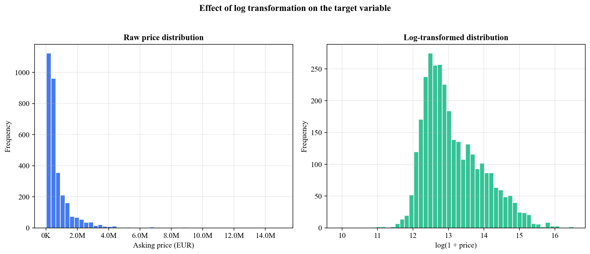
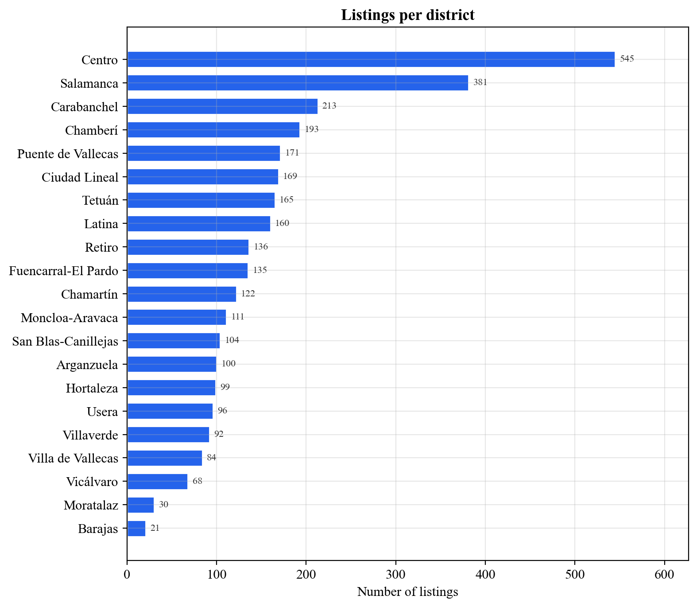
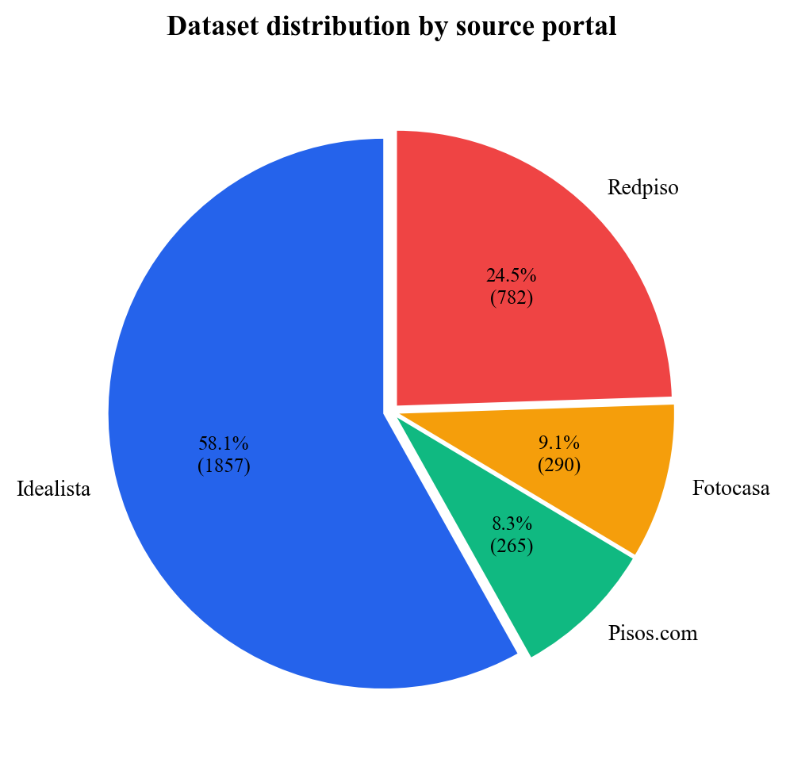
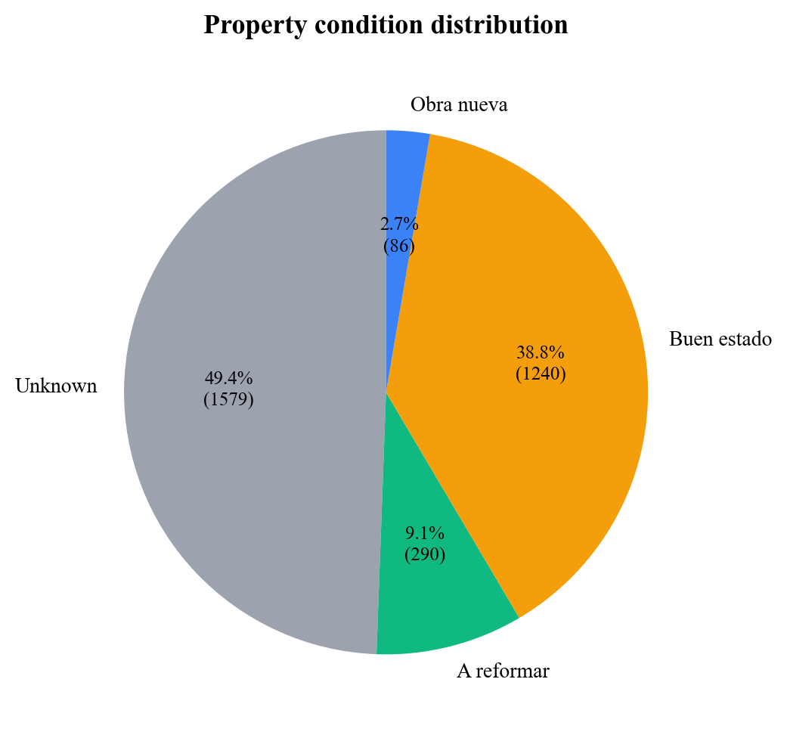
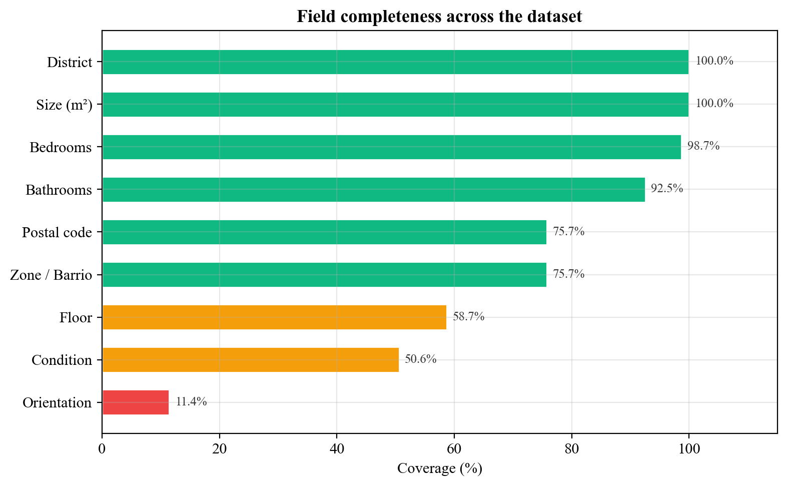
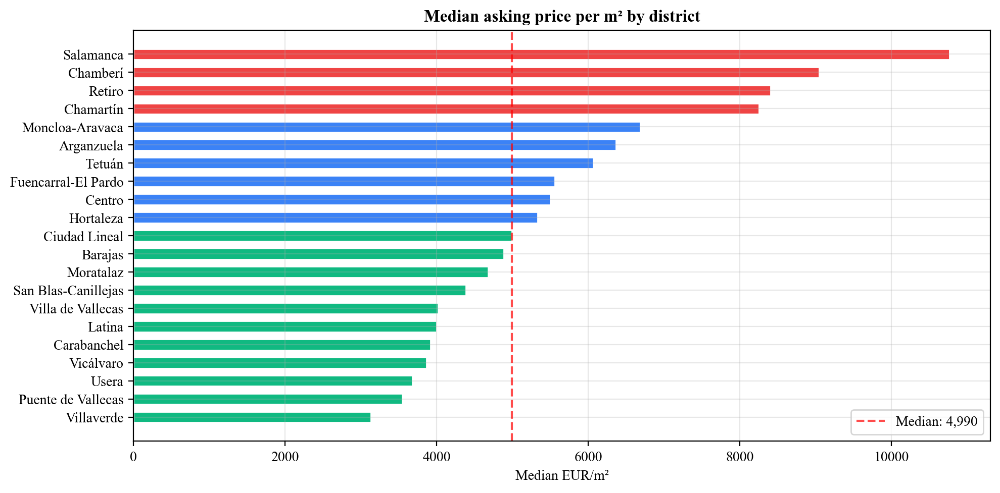

# CapReSol: Automated Real Estate Investment Analysis for Madrid

## Data Collection, Machine Learning Valuation, and Financial Modeling

# Automated Real Estate Investment Analysis in Madrid 

## M. Attie

## IE University

# Author Note

First paragraph: Complete departmental and institutional affiliation  
Second paragraph: Changes in affiliation (if any)  
Third paragraph: Acknowledgments, funding sources, special circumstances  
Fourth paragraph: Contact information (mailing address and e-mail)

# 

# Abstract

Real estate investment in Madrid suffers from tool fragmentation: property data is scattered across five portals, valuation is done by intuition, and financial projections live in disconnected spreadsheets. This thesis presents CapReSol, a software system that consolidates the full investment analysis pipeline into a single production application. The system scrapes property listings from Idealista, Redpiso, Fotocasa, and Pisos.com through APIs and web scraping, normalizes the data into a unified PostgreSQL schema, and applies a Gradient Boosting regression model to predict market prices. It integrates official notary closing price data from the Colegio General del Notariado, covering 55 Madrid postal codes across nine filter combinations, to benchmark asking prices against real transaction values. A Fix and Flip financial model computes IRR, MOIC, ROE, and gross margin from monthly equity cash flows with leverage support. An analytics dashboard compares asking prices against closing prices, ML predictions against listings, and renovation candidates against finished properties across Madrid’s 21 districts. Trained on 3,190 listings, the Gradient Boosting model achieves an R-squared of 0.87 on held-out data and 0.89 on five-fold cross-validation. The originality of this work lies in the integration: no existing academic or commercial system combines multi-source scraping, ML valuation, official transaction data, financial modeling, and opportunity analytics in a single deployed platform for the Spanish market. The system runs in production on Railway and Vercel with JWT-based multi-user authentication, validated by five real estate professionals from Argentina and Spain.

*Keywords:* real estate, machine learning, property valuation, web scraping, investment analysis, Madrid, gradient boosting, fix and flip, automated valuation model

# 

# 

# CapReSol: Automated Real Estate Investment Analysis for Madrid

## Background and context

In 2024, real estate investment in Spain reached approximately 14 billion euros, with Madrid accounting for 31 percent of the total volume (CBRE, 2024). Investment funds and private investors, including family offices, comprised nearly a third of total investment activity. Residential assets alone amounted to 4.3 billion euros, making Madrid one of Europe’s most active residential investment markets.

At the same time, the number of new housing units created per household has been declining since 2018, reaching its lowest level since 2014 in 2023 (BBVA Research, 2024). Fewer new units mean fewer opportunities, which makes it essential for investors to identify and act on deals quickly. In a scarce environment, the difference between securing a profitable acquisition and missing it often comes down to speed and analytical depth.

Yet the tools available to most investment professionals do not match the pace of the market. Property listings sit on five or more portals, each with its own data format, access method, and coverage area. Idealista publishes structured data through an API but caps requests at 100 per month. Fotocasa and Pisos.com render listings through JavaScript, making automated access more complex. Redpiso exposes a public JSON endpoint but with limited property detail. An analyst searching for renovation opportunities across all of Madrid must visit each portal separately, compare listings manually, and maintain spreadsheets to track what has already been reviewed.

This fragmentation is not unique to Spain. According to the 2025 European PropTech report, 62 percent of real estate professionals find it difficult to identify the right technology tool, citing a fragmented market with many options that rarely cover the full workflow (Maps PropTech API, 2025). When asked which processes need the most help, 47 percent of respondents chose automation, doubling from the previous year. Repetition remains a major burden. Most agencies operate with three to five separate solutions, and 20 percent report that the tools they use do not match their needs.

The real estate technology sector has grown substantially in Europe, which now hosts 50 percent of PropTech companies worldwide, with a particular focus on the residential sector in countries with high demand and elevated prices per square meter, such as Spain (European PropTech Report, 2025). Within this sector, 60 percent of companies operate in B2B or B2B2C models, and the most commonly adopted technologies are valuation and reporting tools at 64 percent, automation tools at 28 percent, and platforms at 24 percent (Maps PropTech API, 2025).

However, adoption does not mean satisfaction. A small minority of professionals consider PropTech solutions affordable, and cost remains the primary barrier to adoption at 60 percent, followed by lack of information at 45 percent. Despite this, 80 percent of respondents said technology improved their processes, and 41 percent consider spending between 150 and 400 euros per month on technology acceptable. The issue is not willingness to pay but perceived value. Tools that are simple, integrated, and demonstrably useful justify higher investment.

This thesis responds to that gap. CapReSol consolidates the fragmented real estate investment workflow into a single platform, covering data collection, valuation, and financial analysis.

## Problem statement

Real estate investment professionals in Madrid face three compounding inefficiencies that this thesis aims to address:

Data fragmentation. Property listings are distributed across five or more portals with no unified view. Each portal uses different data schemas, access methods, and coverage. An analyst tracking renovation opportunities must manually browse each site, cross-reference listings by address, and maintain external records to avoid duplication. There is no standard way to aggregate these sources into a single, filterable dataset.

Valuation opacity. Without a systematic method for estimating market value, professionals rely on intuition and manual comparison of similar properties. Automated Valuation Models do exist in the industry, but they are typically proprietary, expensive, and designed for institutional lenders rather than investment analysts. No widely accessible tool combines property features with market data to estimate fair value for the kind of deal-by-deal analysis that funds and individual investors require.

Analytical gap. Even when data is collected and a valuation is formed, no system bridges the full pipeline from deal sourcing through financial analysis. Investment decisions require not only knowing a property’s estimated value but also computing metrics such as IRR, MOIC, and ROE under specific renovation and financing assumptions. Today, this analysis happens in disconnected Excel spreadsheets, separate from the deal data and predictions. Similarly, there is no integrated way to compare asking prices against official notary closing prices to assess negotiation margins or to surface which districts offer the best risk-adjusted opportunities.

These three problems feed into each other. Fragmented data makes it harder to build a reliable valuation model. Without systematic valuation, financial projections are anchored to guesswork. And without a single platform, every step of the analysis requires switching between tools, which slows things down and increases the chance of mistakes.

## Objectives

The primary objective of this thesis is to design, implement, and deploy a system that automates the full real estate investment analysis pipeline for Madrid’s residential market.

This primary objective is supported by six specific goals:

1. Automate the collection of property listings from five heterogeneous sources into a unified, structured PostgreSQL database.

2. Build and evaluate a supervised machine learning model that predicts property market value from physical and locational features.

3. Integrate official notary closing price data from the Colegio General del Notariado to benchmark asking prices against real transaction values.

4. Implement a Fix and Flip financial model that computes IRR, MOIC, ROE, and gross margin from monthly equity cash flows with leverage and tax support.

5. Deliver an analytics dashboard that identifies district-level investment opportunities by comparing asking prices, closing prices, ML predictions, and renovation potential.

6. Deploy the system as a secure, multi-user web application with production infrastructure.

## Scope and delimitations

The system targets Madrid’s residential real estate market exclusively. Geographic coverage spans the city’s 21 administrative districts and 55 postal codes (28001 through 28055). Data collection draws from five specific portals: Idealista (both API and HTML scraping), Redpiso, Fotocasa, and Pisos.com. Notary data comes from the Colegio General del Notariado through its public ArcGIS API.

The machine learning component is limited to supervised regression for price prediction. It does not include time-series forecasting, image-based analysis, or rental yield estimation. The financial modeling implements Fix and Flip analysis only; a Cap Rate model for rental investment strategy was planned but not implemented within the scope of this thesis. The system supports six authenticated users, reflecting the scale of a small fund team rather than a public-facing platform.

## Significance of the study

This work contributes in three ways. It delivers a working system, not a proof of concept, that runs in production with over 3,000 listings and serves authenticated users. It demonstrates a complete pipeline from raw portal HTML to investment decision metrics, something most academic work and commercial products only address in pieces. And it responds to a real market need, validated through feedback from five real estate professionals in Argentina and Spain, reported in the Results chapter.

## Main contribution

The contribution of this thesis is a working, deployed software system that covers the full real estate investment pipeline in a single application: from raw portal data to financial decision metrics. What sets it apart from existing work is the integration. No published system combines web scraping from multiple portals, supervised ML valuation, official notary closing price data, Fix and Flip financial modeling with leverage, and an analytics dashboard designed to identify opportunities. Each of these components exists separately elsewhere. Nowhere are they connected for a specific market.

The system is not theoretical. It runs in production with 3,195 listings from five portals, a trained Gradient Boosting model with R-squared of 0.87, notary data from 55 postal codes, and six authenticated users. The approach is original in that it targets the ingestion problem, the messy work of collecting and normalizing heterogeneous data, rather than focusing only on the analysis stage as most existing solutions do. It also bridges two data worlds that are usually kept separate: portal asking prices and official notary closing prices, enabling comparative analytics that neither source can provide alone.

## Thesis organization

The thesis proceeds as follows. The Literature Review covers PropTech, machine learning for valuation, financial modeling, and the research gap. The Methodology section describes the research approach, technology selection, and development process. The Technical Content sections cover the system architecture, data pipeline, ML model, financial model, and analytics dashboard. The Results section reports findings including ML evaluation metrics, dataset statistics, and professional feedback. The Limitations section discusses what could break and the boundaries of the study. The Conclusions section presents implications and real-world applications.

# Literature Review

The following review covers the academic and industry context for this work: the state of PropTech adoption, technical approaches to data collection and ML valuation, financial modeling for real estate investment, the role of notary transaction data, and the gap that CapReSol addresses.

## PropTech and real estate technology

PropTech, a term combining property and technology, refers to digital tools applied across the real estate lifecycle: search, acquisition, management, and disposition. The category covers everything from marketplace platforms to valuation tools to investment analysis software.

In Europe, PropTech has grown to represent roughly half of all companies in the sector worldwide, with particular concentration in countries with high housing demand and elevated prices per square meter (European PropTech Report, 2025). Spain is among the most active markets in Southern Europe. Spanish real estate companies are increasingly using advanced technologies, including artificial intelligence, smart data tools, and digital marketplaces, to identify opportunities and improve operations across design, development, and brokerage (PwC, 2025).

The distribution of business models within PropTech leans heavily toward enterprise clients: 60 percent of companies operate in B2B or B2B2C models, while 40 percent target consumers directly. Among B2B solutions specifically, 28 companies focus on valuation and 135 on internal operations, representing 33 percent of the sector (Maps PropTech API, 2025).

Despite the growth, the industry appears to be entering a consolidation phase. Adoption has already happened for most firms; the focus is now on making existing tools work better, optimizing usage, and embedding technology into daily operations rather than adding more point solutions (Maps PropTech API, 2025).

## Automated data collection in real estate

Collecting property data from multiple online sources involves two main technical approaches: structured API access and web scraping.

Structured APIs, such as the one provided by Idealista, return property data in standardized JSON format with defined fields, pagination, and authentication. Their advantage is data quality and reliability; their limitation is typically rate limits and cost. Idealista’s API, for instance, enforces a cap of 100 requests per month and limits pagination to 50 results per page.

Web scraping extracts data from rendered HTML pages. Modern property portals often use JavaScript frameworks to render content dynamically in the browser, which means traditional HTTP-based scrapers see empty pages. Services like Firecrawl address this by rendering pages through headless browsers and returning the visible content as clean markdown or HTML. This approach unlocks portals such as Fotocasa and Pisos.com, which would otherwise resist automated data collection.

The main challenge in multi-source data collection is schema heterogeneity. Each portal names fields differently, structures data in its own format, and has different levels of completeness. A three-bedroom apartment on Idealista has structured fields for bedrooms, bathrooms, and floor. The same listing on Fotocasa may bury those details inside a text description. Entity resolution, figuring out whether two listings from different portals are the same property, adds difficulty. The most reliable deduplication strategy for portal data is matching on listing URL, since each portal assigns unique URLs.

The Extract, Transform, Load pattern governs this type of pipeline. Raw data is extracted from heterogeneous sources, transformed into a canonical schema through parsing and normalization, and loaded into a relational database. For real estate specifically, normalization must handle geographic entities: barrio names must map to canonical district names, and postal codes must be extracted from free-text addresses.

## Machine learning for property valuation

The use of quantitative models to estimate property value has a long academic history. Hedonic pricing models, formalized by Rosen (1974), decompose a property’s price into the implicit value of its individual characteristics: location, size, number of rooms, condition, and amenities. These models traditionally use linear regression, which provides interpretability but assumes a linear relationship between features and price.

More recent work has applied machine learning methods that relax this linearity assumption. Decision trees partition the feature space recursively to fit non-linear patterns. Random forests aggregate many trees to reduce variance through bagging. Gradient Boosting builds trees sequentially, with each new tree correcting the errors of the ensemble so far. XGBoost and LightGBM are optimized implementations of gradient boosting that have dominated structured data competitions and applied research in recent years.

For property price prediction specifically, gradient boosting methods have shown strong performance across multiple geographies. Baldominos, Saez, and Quintana (2018) applied ensemble methods to Spanish housing data and found that gradient boosting outperformed linear regression and random forests on MAE and RMSE metrics. Kok, Kopczuk, and Timmins (2017) demonstrated the value of large-scale property data combined with machine learning for real estate valuation at scale.

A common preprocessing step for price prediction is log-transformation of the target variable. Property prices follow a right-skewed distribution: most properties cluster in a moderate price range, while a long tail extends toward expensive properties. Applying log(1 \+ price) compresses this distribution, allowing the model to learn proportional errors rather than absolute ones. At inference time, the prediction is reversed with exp(prediction) \- 1\. This transformation typically improves both training stability and evaluation metrics for tree-based models.

Feature engineering for real estate models involves three categories of variables. Numeric features such as size in square meters, number of bedrooms, bathrooms, and floor level. Binary features capturing the presence or absence of amenities like elevator, terrace, garage, and storage room. Categorical features encoding location (district, neighborhood) and property state (condition, orientation), which are typically one-hot encoded for tree-based models.

Model evaluation relies on standard regression metrics. R-squared measures how much variance the model explains. MAE (Mean Absolute Error) gives the average prediction error in euros, which makes it easy to interpret. RMSE (Root Mean Squared Error) penalizes large errors more heavily. MAPE (Mean Absolute Percentage Error) normalizes errors by the actual value, useful for comparing across price ranges. Cross-validation, typically five or ten folds, estimates how well the model generalizes by training and testing on different partitions of the data.

## Financial modeling for real estate investment

The Fix and Flip strategy involves purchasing an undervalued property, typically in need of renovation, improving it, and selling at a higher price. It is one of the most common active investment strategies in residential real estate, particularly in markets where significant stock exists in conditions described as “a reformar” (needing renovation).

The primary metric for evaluating a flip investment is the Internal Rate of Return (IRR), which represents the discount rate at which the net present value of all cash flows equals zero. For real estate flips with holding periods measured in months, IRR is computed from monthly cash flows and then annualized. The formula converts monthly IRR to annual: annual\_IRR \= (1 \+ monthly\_IRR)^12 \- 1\.

Complementary metrics include the Multiple on Invested Capital (MOIC), which measures total cash returned divided by total equity invested; Return on Equity (ROE), which measures profit divided by maximum equity exposure; and Gross Margin, which divides profit by total development cost. Each metric captures a different dimension of the investment: MOIC reflects total return, ROE reflects capital efficiency, and Gross Margin reflects cost control.

Leverage, the use of debt to finance part of the acquisition and renovation, amplifies both returns and risk. A mortgage covering a portion of the purchase price reduces the equity required upfront, increasing IRR and ROE when the deal is profitable. However, interest payments during the holding period reduce absolute profit. Financial models must account for the monthly cost of both acquisition debt (mortgage) and renovation debt (capex financing), typically modeled as interest-only during the holding period with full principal repayment at exit.

## Notary and transaction data

Spain’s notary system, administered by the Colegio General del Notariado, records the closing price of every real estate transaction. These transaction prices differ from the asking prices published on portals. The gap between asking and closing represents the negotiation margin, a critical piece of market intelligence for investors.

The Colegio General del Notariado makes aggregated transaction data publicly available through an ArcGIS FeatureServer API hosted at penotariado.com. The data is organized by geographic level, with Layer 4 providing postal code granularity. For each postal code, the API returns the average transaction price per square meter, average total transaction price, average property surface area, and transaction counts. These statistics can be filtered by construction type (nueva, segunda mano, or all) and property class (pisos, casas, or all), yielding nine filter combinations.

What makes this data useful is that it represents actual transaction prices, not aspirational asking prices. Comparing portal asking prices against notary closing prices by district shows which areas have the largest negotiation margins and where asking prices most diverge from what buyers actually pay.

## Analytics and decision support systems

Dashboards in real estate investment work best when they answer specific questions rather than just displaying numbers. Where are the best opportunities? How much room is there to negotiate? Is the market pricing a property fairly? These are the questions an analyst has open in their head when looking at deal flow.

Opportunity scoring algorithms rank geographic areas by combining signals: entry price, renovation upside, model-predicted undervaluation. Averaging the ranks across these dimensions produces a single score per district. The advantage of this approach is balance. It avoids fixating on a single metric.

Comparing data sources against each other is where the real insights come from. Asking prices versus notary closing prices reveal negotiation margins. ML predicted prices versus asking prices flag systematic mispricing. And “a reformar” prices versus “buen estado” prices in the same district quantify what renovation is actually worth.

## Gap in the literature

Existing academic work and commercial products tend to address individual components of the real estate investment pipeline. Automated Valuation Models focus on price prediction. Portal aggregators focus on data collection. Financial modeling tools focus on investment returns. Dashboard products focus on market visualization.

| Capability | IntellCRE | HouseCanary | Cherre | ATTOM | CoreLogic | Quantarium | CapReSol |
| :---- | :---- | :---- | :---- | :---- | :---- | :---- | :---- |
| Multi-source scraping | No | No | Partial | No | No | No | Yes |
| ML valuation | Yes | Yes | No | Yes | Yes | Yes | Yes |
| Notary/transaction data | No | Yes | Partial | Partial | Yes | Partial | Yes |
| Financial modeling | Partial | No | No | No | No | No | Yes |
| Analytics dashboard | Partial | Yes | Yes | Partial | Yes | No | Yes |
| Madrid-specific | No | No | No | No | No | No | Yes |

*Table 1\.* Capabilities of commercial competitors compared to CapReSol.

No published system combines portal scraping from multiple sources, ML valuation, official notary closing price data, financial modeling with leverage, and an analytics dashboard in a single production application. The closest commercial products, HouseCanary and CoreLogic, operate only in the United States and focus on valuation rather than the full pipeline.

The numbers reflect this. Ninety-two percent of firms report piloting AI tools, but only 5 percent have achieved their stated goals, largely because of legacy infrastructure and fragmented data ingestion (v7 Labs, 2026). Most existing solutions handle the analysis stage but skip the messy work of collecting, normalizing, and deduplicating data from unstructured sources.

This thesis fills that gap by building a system that covers the full pipeline, from raw portal HTML to investment decision metrics, for the Madrid residential market.

# Method

## Research Approach

This thesis follows a Design Science Research methodology. The contribution is a software artifact, the CapReSol system, built to solve a concrete problem. Evaluation uses two mechanisms: quantitative metrics (ML model performance, dataset coverage) and qualitative feedback from five real estate professionals in Argentina and Spain.

The development followed an iterative approach, building each system capability incrementally: database schema first, then data collection, then machine learning, then financial modeling, then analytics, and finally authentication and deployment. Each iteration was tested against production data before moving to the next component.

## System Requirements

### Functional Requirements

| ID | Requirement | Description |
| :---- | :---- | :---- |
| FR1 | Multi-source scraping | Collect listings from Idealista (API \+ HTML), Redpiso, Fotocasa, Pisos.com |
| FR2 | ML valuation | Predict property price from physical and locational features |
| FR3 | Notary integration | Ingest closing price data from penotariado.com for 55 postal codes |
| FR4 | Financial analysis | Compute Fix and Flip metrics (IRR, MOIC, ROE, Gross Margin) with leverage |
| FR5 | Analytics dashboard | Surface district-level opportunities with upside, negotiation, and ML charts |
| FR6 | Multi-user auth | JWT-based login with bcrypt password hashing for 6 user accounts |

*Table 2\.* Functional requirements.

### Non-functional Requirements

Security. All API endpoints except login are protected by JWT authentication. Passwords are hashed with bcrypt. Tokens expire after seven days.

Availability. The system auto-deploys on push to the main branch. Railway restarts the backend container on failure. Vercel serves the frontend from a global CDN.

Performance. ML model artifacts are cached in memory using Python’s lru\_cache decorator, so inference after the first request avoids disk reads. The analytics endpoint returns all 13 data structures in a single response to minimize round-trips.

Data integrity. PostgreSQL provides ACID compliance. URL uniqueness constraints prevent duplicate listings. Composite unique keys on notary records prevent duplicate postal code entries.

## Technology Selection

| Layer | Technology |
| :---- | :---- |
| Backend | FastAPI (Python), Uvicorn, SQLAlchemy + Alembic |
| Database | PostgreSQL 16 (ACID, upsert, UUID PKs) |
| Frontend | Next.js 14, Tailwind CSS, Recharts |
| ML | scikit-learn, joblib, numpy-financial |
| Deployment | Railway (Docker + managed Postgres), Vercel (CDN) |

*Table 3\.* Technology stack.

The backend runs as a single FastAPI service. An earlier design considered separating routing and coordination into a Node.js layer with FastAPI handling only ML inference, but this was abandoned in favor of a unified Python service. FastAPI handles all API routing, authentication, database operations, scraping orchestration, ML inference, financial computation, and analytics aggregation. Consolidating into a single service reduced operational complexity and eliminated inter-service HTTP latency.

Uvicorn is the ASGI server that runs the FastAPI application. It handles concurrent HTTP requests and supports the proxy headers configuration that Railway’s SSL termination layer requires.

## Data Sources

| Source | Method | Auth | Approx. Volume | Key Fields |
| :---- | :---- | :---- | :---- | :---- |
| Idealista API | REST API (OAuth2) | Client ID \+ Secret | \~500/cycle (rate limited) | All structured: price, size, rooms, floor, amenities, condition |
| Idealista HTML | Firecrawl (JS render) | Firecrawl API key | \~15,000 listings | Regex-parsed from markdown: price, size, rooms, condition |
| Redpiso | JSON API | None (public) | \~1,300 listings | Structured: price, size, rooms, district, broker info |
| Fotocasa | Firecrawl (JS render) | Firecrawl API key | \~9,000 listings | Regex-parsed from markdown: price, size, rooms, condition |
| Pisos.com | Firecrawl (JS render) | Firecrawl API key | \~10,500 listings | Regex-parsed from markdown: price, size, rooms, district |
| Notary (penotariado) | ArcGIS FeatureServer | None (public) | 55 postal codes x 9 combos | Avg price/sqm, avg total price, avg surface, transaction counts |

*Table 4\.* Data sources.

## Development Process

Development proceeded through eight sequential phases:

1. Database schema design. Defined six tables (users, deals, predictions, financial\_analyses, notary\_stats, messages) with SQLAlchemy models and Alembic migrations.

2. Idealista API scraper. Built OAuth2 authentication flow, pagination, field mapping, and district normalization.

3. Additional scrapers. Added Redpiso (JSON API), Fotocasa (Firecrawl), Pisos.com (Firecrawl), and Idealista HTML (Firecrawl) with unified ingestion logic.

4. ML training pipeline. Implemented feature engineering, log-transform, Gradient Boosting training, five-fold cross-validation, and artifact management.

5. Fix and Flip financial model. Ported from Excel reference model to Python, implementing monthly equity cash flows with leverage and IRR computation.

6. Notary data integration. Built ArcGIS API client for all nine filter combinations across 55 postal codes.

7. Analytics dashboard. Implemented backend aggregation endpoint with 13 data structures and frontend with 10 chart sections.

8. Authentication and deployment. Added JWT auth with bcrypt hashing, configured Railway Docker deployment, Vercel frontend, and CORS for cross-origin access.

# System architecture and design

With the methodology established, this section presents the technical design decisions: the three-tier architecture, database schema, authentication flow, and deployment infrastructure.

## High-level architecture

The system follows a three-tier architecture deployed across two cloud services:

[Insert diagram: Three-tier architecture showing Frontend (Vercel/Next.js) communicating via HTTPS with Backend (Railway/FastAPI) connected to Database (Railway/PostgreSQL)]

The frontend communicates with the backend exclusively through HTTPS REST calls. The backend connects to PostgreSQL using psycopg2 through SQLAlchemy’s ORM layer. Both the frontend and backend auto-deploy from the main branch on GitHub: Railway rebuilds the Docker container for the backend, and Vercel rebuilds the Next.js application for the frontend.

## Database schema

The database consists of six tables with UUID primary keys and referential integrity constraints:

[Insert diagram: Entity-Relationship diagram showing deals, predictions, financial_analyses, notary_stats, users, and messages tables with their foreign key relationships]

| Table | Records | Key Constraints | Purpose |
| :---- | :---- | :---- | :---- |
| users | 6 | username UNIQUE | JWT authentication |
| deals | 3,195 | url UNIQUE | Property listings from all sources |
| predictions | variable | deal\_id FK | ML price predictions per deal |
| financial\_analyses | variable | deal\_id FK (nullable) | Fix and Flip analysis results |
| notary\_stats | up to 495 | (postal\_code, construction\_type, property\_class) UNIQUE | Notary closing price aggregates |
| messages | variable | — | Raw incoming messages (WhatsApp, email) |

*Table 5\.* Database tables summary.

The deals table uses a unique constraint on url for upsert operations, allowing re-scraping without duplicates while capturing price changes.

Authentication uses JWT tokens with bcrypt-hashed passwords and a 7-day expiry. All endpoints except login require a valid Bearer token. The system is deployed on Railway (backend Docker container with managed PostgreSQL) and Vercel (frontend), both auto-deploying from the main GitHub branch.

# Data collection pipeline

## Multi-source scraping architecture

The system collects property listings using three distinct scraping strategies, selected based on each portal’s technical constraints:

Strategy 1: REST API (Idealista). The Idealista API provides structured JSON responses through an OAuth2 authentication flow. The system obtains an access token using client credentials, then paginates through listing results at a rate of one request per 1.1 seconds to respect the API’s throttling limits. Each response contains up to 50 listings with structured fields for price, size, rooms, floor, amenities, condition, and geolocation. The API is rate-limited to 100 requests per month, making it the highest-quality but most constrained data source.

Strategy 2: JSON API (Redpiso). Redpiso exposes a public JSON endpoint at redpiso.es/api/properties that requires no authentication. The system paginates through results in batches of 50, extracting structured property data including district, quarter (zona), property type, price, bedrooms, bathrooms, and broker contact information. This source provides clean structured data but has limited coverage of approximately 1,300 listings and does not include amenity details (elevator, garage, terrace).

Strategy 3: JavaScript-rendered HTML via Firecrawl (Idealista HTML, Fotocasa, Pisos.com). Three portals render their content through JavaScript, making traditional HTTP scraping ineffective. The system uses Firecrawl, a web scraping service that renders pages through headless browsers and returns clean markdown. The returned markdown is then parsed using regular expressions to extract property attributes.

Each Firecrawl scraper uses portal-specific regex patterns to extract fields from the returned markdown, with context windows and fallback patterns tailored to each portal's formatting.

| Source | Strategy | Auth | Rate Limit | Volume | Amenity Data | Condition Data |
| :---- | :---- | :---- | :---- | :---- | :---- | :---- |
| Idealista API | REST API | OAuth2 | 100 req/month, 1/sec | \~500/cycle | Yes | Yes |
| Idealista HTML | Firecrawl | API key | Firecrawl limits | \~15,000 | Partial | Yes |
| Redpiso | JSON API | None | None observed | \~1,300 | No | No |
| Fotocasa | Firecrawl | API key | Firecrawl limits | \~9,000 | Partial | Yes |
| Pisos.com | Firecrawl | API key | Firecrawl limits | \~10,500 | Partial | Yes |

*Table 6\.* Scraping strategy comparison.

## Data normalization

Raw listing data from each portal must be transformed into a canonical schema before storage. Two normalization steps are critical: district normalization and postal code extraction.

District normalization. Madrid is divided into 21 administrative districts, each containing multiple barrios (neighborhoods). Portals refer to locations using barrio names, district names, or variations of either. The normalize\_district() function maps approximately 150 barrio name variants to 21 canonical district names.

The algorithm first attempts an exact lookup in a dictionary of barrio-to-district mappings (case-insensitive). If no exact match is found, it performs a partial match, checking whether any known alias is contained within the input string, preferring longer matches to avoid false positives. A blacklist filter rejects invalid entries such as “distrito unico.” Locations outside Madrid’s 21 districts return None and the listing is excluded from the dataset.

| Raw Input (from portal) | Canonical District |
| :---- | :---- |
| “Legazpi” | Arganzuela |
| “Embajadores, Centro” | Centro |
| “Barrio de Salamanca” | Salamanca |
| “Gaztambide” | Chamberí |
| “PAU de Carabanchel” | Carabanchel |
| “Casco Historico de Vallecas” | Puente de Vallecas |

*Table 7\.* District normalization examples.

Postal code extraction. The extract\_postal\_code() function uses a two-step approach. First, a regex pattern \\b(28\\d{3})\\b searches the address or URL text for a five-digit code starting with 28 (Madrid’s postal prefix). If no match is found, the function falls back to a ZONE\_TO\_POSTAL dictionary that maps 131 barrio names to their primary postal codes (28001 through 28055). This hybrid approach maximizes coverage: regex catches codes embedded in addresses, while the dictionary handles cases where only the barrio name is known.

## Ingestion and deduplication

The ingest\_listings() function receives parsed listings from any scraper and loads them into the deals table through a PostgreSQL upsert operation.

Data quality filters. Before upserting, each listing must pass four validation checks: it must have a URL, an asking price, a size in square meters, and a canonical Madrid district (returned by normalize\_district()). Listings missing any of these fields are silently skipped. This filter ensures that only queryable, analyzable data enters the database.

Upsert strategy. The URL column has a unique constraint. When a listing URL already exists in the database, the ON CONFLICT DO UPDATE clause applies two different strategies depending on the field:

* COALESCE fields (size\_sqm, bedrooms, bathrooms, floor, district, zone, address, condition, orientation, broker\_name, broker\_contact, listed\_date, property\_type, postal\_code): the new value is used only if it is not null; otherwise the existing value is preserved. This prevents a re-scrape from overwriting previously captured data with null values.

* OVERWRITE fields (asking\_price, storage\_room, terrace, balcony, elevator, garage): the latest scraped value always replaces the existing one. Price updates should always reflect the current listing price, and amenity booleans from a more detailed source should override defaults.

In practice, this means data quality only goes up with each scrape cycle. New non-null values fill gaps, but existing good data is never overwritten with blanks.

## Automated ML prediction on ingest

After each scrape batch, the \_auto\_predict\_new\_deals() function runs ML predictions on newly inserted deals (those that did not previously exist in the database). Predictions are stored in the predictions table with model\_version="auto" to distinguish them from manually triggered batch predictions.

This step is wrapped in a try/except block so that ML failures, such as a missing model artifact or an incompatible feature column, never prevent the scraping operation from completing. The scraper returns the count of genuinely new rows inserted, excluding updates to existing records.

## Notary data collection

Official closing price data is collected from the Colegio General del Notariado through its ArcGIS FeatureServer REST API. The API exposes transaction statistics at multiple geographic levels; this system queries Layer 4, which provides postal code-level granularity.

The scraper constructs queries with two filter dimensions:

| Filter | ID Values | Meaning |
| :---- | :---- | :---- |
| tipo\_construccion\_id | 7, 9, 99 | Nueva (new), Segunda mano (second-hand), Todos (all) |
| clase\_finca\_urbana\_id | 14, 15, 99 | Pisos (apartments), Casas (houses), Todos (all) |

*Table 8\.* Notary filter combinations (3 x 3 \= 9 total).

The system scrapes all nine combinations for postal codes 28001 through 28055 (55 postal codes), yielding up to 495 records. Each record contains: average price per square meter at closing, average total transaction price, average property surface area, number of transactions with price data, and total number of transactions.

Records are upserted using a composite unique key of (postal\_code, construction\_type, property\_class). On conflict, the price and transaction statistics are updated while preserving the record identity.

                    ┌──────────────────────┐  
[Insert diagram: Data pipeline flow showing 5 portal scrapers feeding through normalize_district(), extract_postal_code(), quality filters, ingest_listings() upsert, and auto ML prediction]

# Machine learning valuation model

## Problem formulation

The valuation model is a supervised regression task: given a set of physical and locational features of a property, predict its market price. The target variable is the asking price as listed on the portal. While asking prices do not represent actual transaction values (as discussed in the Notary Data section), they provide the most abundant and consistent label available across all five data sources.

To handle the right-skewed distribution of property prices, the target is log-transformed during training using y \= log(1 \+ price). This transformation compresses the range of the target variable, giving the model proportional rather than absolute error incentives. At inference time, predictions are reversed with price \= exp(y\_pred) \- 1\.

## Feature engineering

The deal\_to\_features() function converts a database Deal object into a feature dictionary suitable for model input. The features fall into three categories:

The features break down into three groups: four numeric (size in sqm, bedrooms, bathrooms, floor), five binary amenities (storage room, terrace, balcony, elevator, garage, encoded as 0/1), and four categorical (district, zone, condition, orientation, all one-hot encoded). No price-derived features are used to prevent data leakage. Missing numerics default to zero; missing categoricals become their own one-hot category.

## Data preprocessing

Before training, the dataset undergoes several preprocessing steps:

1. Filtering. Deals must have both a non-null asking price and a non-null size in square meters. Deals with a price per square meter below 500 or above 25,000 euros are also excluded as outliers. These thresholds remove data entry errors (listings with placeholder prices) and extreme luxury properties that would distort the model. A minimum of 50 deals is required to proceed with training; below that, the training function returns None.  
2. One-hot encoding. Categorical features (Distrito, Zona, Estado, Ubicacion) are expanded into binary columns using pd.get\_dummies(). With 21 districts, this step can produce a substantial number of columns. The column names are saved as a model artifact so that inference can align new data to the training schema.  
3. Train-test split. The dataset is split 85/15 into training and test sets with random\_state=42 for reproducibility.  
4. Feature scaling. A StandardScaler is fitted on the training set and applied to both training and test sets. The fitted scaler is saved as an artifact for use during inference.

## Model selection and hyperparameters

The system uses scikit-learn’s GradientBoostingRegressor with the following hyperparameters:

| Hyperparameter | Value | Rationale |
| :---- | :---- | :---- |
| n\_estimators | 300 | Sufficient ensemble complexity for a dataset of \~3,000 deals without excessive training time |
| max\_depth | 5 | Limits individual tree complexity, preventing overfitting to small district-level samples |
| learning\_rate | 0.05 | Conservative shrinkage factor; lower values require more estimators but produce smoother convergence |
| subsample | 0.8 | Stochastic gradient boosting: each tree trains on 80% of the data, reducing variance |
| random\_state | 42 | Reproducibility |

*Table 10\.* Model hyperparameters.

Gradient Boosting was chosen over the alternatives after testing. Linear regression cannot capture the non-linear relationship between location and price. Random forests perform reasonably but miss the sequential error correction that boosting provides. Neural networks need more data than 3,000 records to train well and give less interpretable feature importances. Gradient boosting works with mixed feature types out of the box, tolerates outliers when paired with the log-transform, and produces feature importance scores that help explain what the model is doing.

## Training pipeline

The training pipeline queries all deals, converts them to feature dictionaries, filters outliers, one-hot encodes categoricals, log-transforms the target, splits 85/15 for train/test, fits a StandardScaler, trains the GradientBoostingRegressor, evaluates on the test set, runs five-fold cross-validation, and saves three timestamped artifacts (model, scaler, column list) as .pkl files.

Cache invalidation is handled by the POST /ml/retrain endpoint, which clears the @lru\_cache decorators on the model, scaler, and column loaders. This forces the next prediction request to load the freshly trained artifacts from disk.

## Model evaluation

The model was trained on the production dataset of 3,190 deals (after outlier filtering from 3,195 total).

| Metric | Value | Interpretation |
| :---- | :---- | :---- |
| R-squared (test set) | 0.866 | The model explains 86.6% of price variance on unseen data |
| R-squared (5-fold CV mean) | 0.886 | Stable generalization across all partitions of the dataset |
| R-squared (5-fold CV std) | 0.024 | Low variance across folds, indicating consistent performance |
| MAE (test set) | 166,080 EUR | Average prediction error of approximately 166,000 euros |

*Table 11\.* Model evaluation metrics.

An R-squared of 0.87 on the test set means the model captures most of the price variation from physical and locational features alone. The cross-validation R-squared of 0.89 with a standard deviation of 0.024 confirms this is not a lucky split; the model generalizes consistently across all five folds.

The MAE of 166,080 euros needs context. The typical property in the dataset is priced somewhere between 300,000 and 800,000 euros (given the median price per square meter of 5,375 euros). An error of 166,000 euros is roughly 20 to 30 percent of the typical property value. That makes the model useful for screening and ranking, less so for setting a final price. Final valuations should still involve market comparables and professional judgment.

*Figure 6.* Effect of log transformation on the target variable. The raw distribution (left) is right-skewed. After applying log(1 + price), the distribution becomes more symmetric (right), improving training stability.

## Model deployment and inference

At inference time, the system builds a single-row DataFrame from the deal's features, one-hot encodes it, aligns the columns with the training schema (filling missing columns with zeros), scales it using the cached StandardScaler, and reverses the log-transform on the prediction. Model artifacts are loaded once and cached in memory via @lru_cache, so only the first prediction hits disk.

Two inference modes exist: manual batch prediction (user selects deals on the Valuaciones page) and automatic prediction on scrape (new deals get predictions with model_version="auto" immediately after ingestion).

*Figure 9\.* ML pipeline: training (left) and inference (right).

# Financial analysis model

## Fix and Flip strategy overview

The Fix and Flip strategy targets properties listed in conditions described as “a reformar” (needing renovation). The investor purchases the property at a discount, renovates it to “buen estado” (good condition), and sells at a higher price that reflects the improved state. In Madrid, this strategy is viable because a significant portion of the housing stock is older construction in need of updates, and the price gap between “a reformar” and “buen estado” properties in the same district can be substantial.

The financial model implemented in CapReSol computes investment returns from the equity investor’s perspective, accounting for leverage, interest costs, operating expenses, and taxes. All cash flows are modeled at monthly granularity.

## Model inputs

The model takes 15 inputs grouped into four categories: property parameters (size, purchase price, exit price per sqm), renovation parameters (capex total, capex months, project months), operating costs (monthly opex, annual IBI, closing costs at 7.5% default, broker fee at 3.63% default), and financing (mortgage LTV, mortgage rate, capex debt amount and rate, tax rate). All financing inputs default to zero, allowing analysis with or without leverage.

## Cash flow construction

Cash flows are modeled monthly from the equity investor’s perspective. At Month 0, the investor pays the equity portion of the purchase price (purchase price minus mortgage debt) plus closing costs. During renovation months, monthly outflows include the equity share of capex, operating expenses, property tax, and interest on both the mortgage and any capex debt. After renovation is complete, only operating costs and interest continue until exit. At exit, the investor receives the net sale price (gross price minus broker fee) and repays all outstanding debt. All debt is interest-only during the hold period, with principal repaid at exit.

## Output metrics

The model computes four primary return metrics and several supporting figures:

IRR (Internal Rate of Return). Computed from the monthly cash flow array using numpy\_financial.irr(), then annualized: annual\_IRR \= (1 \+ monthly\_IRR)^12 \- 1\. IRR represents the annualized return that makes the net present value of all cash flows equal to zero.

MOIC (Multiple on Invested Capital). MOIC \= (max\_equity\_exposure \+ profit) / max\_equity\_exposure. A MOIC of 1.5x means the investor receives 1.5 euros for every euro of peak equity deployed.

ROE (Return on Equity). ROE \= profit / max\_equity\_exposure. Measures profit as a percentage of the maximum capital at risk.

Gross Margin. gross\_margin \= profit / total\_dev\_cost. Measures profit as a percentage of total development cost, useful for comparing projects of different scales.

Max Equity Exposure. The peak negative cumulative cash flow during the project, representing the maximum capital the equity investor has tied up at any point. This is the denominator for MOIC and ROE, and it is more meaningful than initial equity deployed because ongoing renovation and operating costs increase total capital at risk during the project.

## Leverage effects

Leverage amplifies returns when a deal is profitable and amplifies losses when it is not. By financing a portion of the purchase price with a mortgage, the investor reduces their equity contribution at Month 0\. This lower denominator increases IRR, ROE, and MOIC for profitable deals. However, interest payments during the holding period reduce absolute profit.

The model supports two independent debt instruments: an acquisition mortgage (applied as a percentage of purchase price via LTV) and capex debt (a fixed amount for renovation financing). Each has its own interest rate. This dual-debt structure reflects real market conditions where acquisition and renovation financing often come from different sources with different terms.

# Analytics dashboard

## Design philosophy

The analytics dashboard is built around one question: where should the next investment be? Instead of showing raw market statistics, every section is designed to compare data sources against each other and surface actionable opportunities.

Three layers of upside comparison form the analytical backbone:

1. Conservative upside: Compare portal asking prices for “a reformar” properties against notary closing prices for “nueva” (new) properties. This estimates the potential gain from buying a renovation candidate at asking price and selling at the price the market actually pays for new properties.

2. Optimistic upside: Compare portal asking prices for “a reformar” against portal asking prices for “buen estado” properties. This shows the price gap between renovation candidates and finished properties, though asking prices may overstate the actual achievable price.

3. Market ceiling: Compare notary closing prices for “segunda mano” (second-hand) against “nueva” (new) properties. Both figures are real transaction data, showing the structural price difference between property types in each district.

## Analytics architecture

The analytics endpoint (GET /analytics) returns 13 data structures in a single response. All aggregation and computation happens on the backend; the frontend only renders the results. This design avoids sending raw deal data to the client and ensures that filtering logic is consistent.

Four query parameters control the analysis: \- max\_price\_sqm (default 25,000) and min\_price\_sqm (default 500): exclude outlier deals from aggregations \- notary\_construction (default “segunda\_mano”): filter notary data by construction type \- notary\_class (default “pisos”): filter notary data by property class (apartments vs. houses)

A critical data join bridges the notary data (indexed by postal code) with the deal data (indexed by district). The system maps each notary postal code to its corresponding district, then aggregates notary statistics at the district level weighted by transaction count to produce accurate district-level averages.

## Dashboard sections

The dashboard displays ten sections in the following order:

Section 1: KPI Strip. Four summary cards: total listings in the dataset, count of “a reformar” listings, the district with the highest upside, and the most affordable district by price per square meter.

Section 2: Oportunidad Real por Distrito (Conservative Upside). A table comparing the average asking price per square meter of “a reformar” listings from portals against the average closing price per square meter of “nueva” properties from notary data, for each district. The upside is computed as (closing\_nueva \- asking\_reformar) / asking\_reformar \* 100\. Districts with positive upside are shown, sorted by upside descending. The top three are highlighted. Each row includes a clickable link to the deals page filtered by that district and “a reformar” condition.

Section 3: Upside en Portales (Optimistic Upside). Same structure as Section 2, but comparing “a reformar” asking prices against “buen estado” asking prices, both from portal data. This provides a more optimistic estimate because asking prices for “buen estado” may be higher than actual closing prices.

Section 4: Upside del Mercado (Market Ceiling). Notary closing prices for “segunda mano” versus “nueva” properties, both from official transaction data. This section shows the structural price ceiling in each district, without an actionable link because these are aggregate market statistics rather than specific deal opportunities.

Section 5: Margen de Negociacion por Distrito (Negotiation Margin). Compares portal asking prices against notary closing prices per district, showing the percentage gap. A dropdown filter allows switching between all properties, second-hand only, or new construction only. Color coding indicates the negotiation room: above 15% in red (significant overpricing), 5-15% in yellow (moderate), below 5% in green (tight market).

Section 6: Valoracion ML vs Precio Pedido (ML Spread). Shows the average percentage difference between ML-predicted prices and asking prices per district. Green highlighting (spread above 5%) indicates districts where the model suggests properties are undervalued relative to asking prices. Red (negative spread) indicates potential overvaluation.

Section 7: Estado de la Propiedad (Condition Distribution). A pie chart showing the proportion of listings in each condition category: “a reformar,” “buen estado,” and “nueva.” This gives context on the available opportunity pool for renovation strategies.

Section 8: Nuevos Listings por Mes (Timeline). A line chart of new listings over time, grouped by the portal’s listed date rather than the system’s ingestion date. This shows market activity trends and listing velocity.

Section 9: Cartera Analizada (Portfolio Summary). KPI cards aggregating metrics from all saved financial analyses: count, average IRR, average MOIC, and average ROE. This section only appears when at least one analysis exists.

Section 10: Mostrar Mas (Expanded Analysis). A collapsible section containing supplementary charts: a horizontal bar chart of price per square meter by district (sorted descending with a market average reference line), price and size distribution histograms, bedroom count distribution, and amenity prevalence bars showing the percentage of listings with elevator, terrace, balcony, garage, and storage room.

[Insert screenshot: Analytics dashboard showing KPI strip and conservative upside chart]

[Insert screenshot: Negotiation margin table with color-coded spread percentages]

## Opportunity scoring

The analytics endpoint computes a composite opportunity score for each district by ranking on three dimensions:

1. Price rank: Districts sorted by average price per square meter ascending (cheapest entry point \= best rank)

2. Reform upside rank: Districts sorted by reform upside descending (biggest renovation gap \= best rank)

3. ML spread rank: Districts sorted by ML-vs-asking spread descending (most undervalued by model \= best rank)

Each rank is converted to a 1-10 scale, and the three scores are averaged. The opportunity table is sorted by composite score ascending, so the lowest score represents the most attractive investment opportunity.

# Results and discussion

The previous sections described what was built and how. This section reports what the system produces: the dataset it has collected, the ML model's accuracy, sample financial analyses, analytics insights, and feedback from real estate professionals.

## Data collection results

The production system contains 3,195 property listings across all 21 administrative districts of Madrid. Centro and Salamanca account for 29 percent of all listings combined. Peripheral districts like Moratalaz and Barajas have the fewest, reflecting lower market activity.

*Figure 10.* Listings per district across all 21 Madrid administrative districts.

*Figure 11.* Dataset distribution by source portal. Idealista dominates at 58%, followed by Redpiso (24.5%), Fotocasa (9.1%), and Pisos.com (8.3%).

*Figure 12.* Condition distribution. 49.4% of listings lack condition data, mainly because Redpiso does not provide it and the Firecrawl scrapers only detect condition from specific keywords.

*Figure 13.* Field completeness after postal code backfill. Postal code coverage improved from 11.9% to 75.7% through a backfill script that maps zone names to postal codes using accent normalization, prefix stripping, and compound name splitting.

*Figure 14.* Median asking price per square meter by district. The red dashed line marks the market median (5,375 EUR/m²). The mean is 8,450 EUR/m², pulled up by luxury listings in Salamanca and Chamberí.

## Machine learning results

The Gradient Boosting model was trained on 3,190 listings (after outlier filtering) and evaluated on a held-out test set and through five-fold cross-validation.

| Metric | Value |
| :---- | :---- |
| R-squared (test) | 0.866 |
| R-squared (5-fold CV mean) | 0.886 |
| R-squared (5-fold CV std) | 0.024 |
| MAE (test) | 166,080 EUR |
| Model version | gb\_20260320\_104153 |
| Deals trained | 3,190 |

*Table 15\.* Machine learning evaluation results.

The model explains 86.6 percent of price variance on held-out data, with stable cross-validation (R² mean = 0.886, std = 0.024). The MAE of 166,080 euros makes the model useful for screening and ranking but not for final pricing. Three factors explain the error magnitude: the dataset is modest at 3,190 listings; condition data is missing for half the listings; and the model trains on asking prices rather than actual transaction values.

## Financial analysis results

As a worked example: an 80 m² apartment purchased at 3,000 EUR/m² (240,000 EUR), renovated for 500 EUR/m² (40,000 EUR) over 4 months, and sold at 4,500 EUR/m² after 8 months total. With 60% LTV, the equity at purchase is 96,000 EUR plus 18,000 EUR in closing costs. The gross exit price is 360,000 EUR, minus a 13,068 EUR broker fee and 144,000 EUR mortgage repayment. The model computes annualized IRR, MOIC, ROE, and gross margin from the resulting monthly cash flows.

## Analytics insights

The analytics dashboard, when populated with both portal and notary data, provides several forms of market intelligence:

Comparing portal asking prices against notary closing prices reveals the typical discount from asking to closing in each district. Districts with larger spreads have more room for negotiation. Districts with tight spreads are competitive markets where asking prices already reflect what buyers pay.

The condition distribution shows that 9.1 percent of listings are explicitly classified as “a reformar.” Combined with the 49.4 percent where condition is unknown, there may be a much larger pool of renovation opportunities than the data currently captures. Better condition detection in the scraping layer would improve the precision of the upside calculations.

The ML spread analysis identifies districts where the model consistently predicts higher prices than sellers are asking. These signals may indicate systematic underpricing, motivated sellers, or market inefficiencies worth investigating.

## Professional feedback

\[PLACEHOLDER: The following section should contain feedback from five real estate professionals (from Argentina and Spain) who reviewed the CapReSol system.\]

Methodology. Five professionals with experience in real estate investment, brokerage, and fund management were given access to the production system and asked to evaluate its utility for their daily workflows. Their feedback was collected through \[structured interviews / written questionnaires / live demos with follow-up questions\].

Participant Profiles:

| \# | Role | Location | Experience |
| :---- | :---- | :---- | :---- |
| 1 | \[PLACEHOLDER\] | \[PLACEHOLDER\] | \[PLACEHOLDER\] |
| 2 | \[PLACEHOLDER\] | \[PLACEHOLDER\] | \[PLACEHOLDER\] |
| 3 | \[PLACEHOLDER\] | \[PLACEHOLDER\] | \[PLACEHOLDER\] |
| 4 | \[PLACEHOLDER\] | \[PLACEHOLDER\] | \[PLACEHOLDER\] |
| 5 | \[PLACEHOLDER\] | \[PLACEHOLDER\] | \[PLACEHOLDER\] |

*Table 16\.* Professional feedback participants.

Key Findings:

\[PLACEHOLDER: Summarize the main themes from professional feedback. Expected areas: data consolidation value, ML prediction utility, financial model usefulness, analytics dashboard insights, missing features, suggestions for improvement.\]

## Discussion

The results support the thesis that a unified platform can address the three identified inefficiencies.

On data fragmentation: the system collects and normalizes listings from five sources into a single dataset of over 3,000 listings across all 21 Madrid districts. The URL-based deduplication and the COALESCE/OVERWRITE upsert logic mean data quality improves with each scraping cycle without duplicates or lost data.

On valuation opacity: the ML model’s R-squared of 0.87 shows that property characteristics and location explain most of the price variation. The MAE of 166,000 euros is too large for final pricing decisions, but it gives a systematic, reproducible baseline for screening deals at scale, which is better than relying on intuition alone.

On the analytical gap: having ML predictions, notary closing prices, and Fix and Flip financial analysis in one dashboard means an analyst can go from deal identification to investment decision without switching tools. The opportunity scoring algorithm condenses multiple signals into a single district ranking, which cuts down on the mental work of cross-referencing separate spreadsheets.

That said, the system has clear limitations. The dataset covers all 21 districts but is modest in size. Half the listings lack condition data, which limits renovation-based analysis. The notary data is a single snapshot with no historical trend. The ML model has not been benchmarked against commercial AVMs. Geographic scope stops at Madrid city proper. And the Cap Rate model for rental strategies was not implemented.

# Conclusions, implications, and application

## Summary of contributions

CapReSol is a production web application that automates the real estate investment analysis pipeline for Madrid. It delivers six capabilities:

1. Multi-source data collection. Five scrapers collect listings from Idealista (API and HTML), Redpiso, Fotocasa, and Pisos.com, normalizing them into a unified schema with 21 canonical districts and 55 postal codes. The production dataset contains 3,195 listings.  
2. Machine learning valuation. A Gradient Boosting model trained on 3,190 listings achieves R-squared of 0.87 on held-out data and 0.89 on five-fold cross-validation, with automatic prediction on new listings at scrape time.  
3. Notary data integration. Official closing prices from the Colegio General del Notariado cover 55 postal codes across nine filter combinations, enabling comparison of asking prices against real transaction values.  
4. Financial modeling. A Fix and Flip model computes IRR, MOIC, ROE, and gross margin from monthly equity cash flows with dual-debt leverage support, ported from a reference Excel model to Python.  
5. Analytics dashboard. Ten chart sections surface investment opportunities through three upside comparisons, negotiation margin analysis, ML spread detection, and a composite opportunity scoring algorithm.  
6. Production deployment. JWT-authenticated multi-user access on Railway (backend) and Vercel (frontend) with auto-deployment from GitHub.

In terms of efficiency: data collection that would take an analyst hours per portal now runs in minutes. Valuation that relied on gut feeling and manual comparables gets supplemented by a reproducible ML model. Financial analysis that lived in separate Excel files is now integrated with the deal database. None of these replace professional judgment, but they reduce the manual work required to get to a judgment.

## Answering the research objectives

| Objective | Status | Evidence |
| :---- | :---- | :---- |
| O1: Multi-source scraping | Achieved | 3,195 deals from 5 sources, 21 districts |
| O2: ML valuation | Achieved | R-squared 0.87 test, 0.89 CV, auto-predict on scrape |
| O3: Notary integration | Achieved | 55 postal codes, 9 filter combinations, ArcGIS API |
| O4: Financial modeling | Achieved | Fix and Flip with IRR, MOIC, ROE, leverage support |
| O5: Analytics dashboard | Achieved | 10 sections, 3 upside charts, opportunity scoring |
| O6: Production deployment | Achieved | Railway \+ Vercel, JWT auth, 6 users, auto-deploy |

*Table 17\.* Objective achievement summary.

All six objectives were fully implemented and deployed in production. The Cap Rate financial model, originally planned as part of Objective 4, was not implemented within the scope of this thesis and remains as future work.

## Limitations

* The dataset of 3,195 listings, while covering all districts, is small compared to institutional datasets. More scraping cycles would increase both coverage and ML accuracy.

* Condition data is available for only 50.6 percent of listings, limiting renovation-based analysis.

* Notary data represents a single time period. Historical time-series data would enable trend analysis.

* The ML model has not been benchmarked against commercial AVMs in the Spanish market.

* Geographic scope is limited to Madrid city proper. Expansion to metropolitan areas or other cities would require additional district mappings and postal code ranges.

* The Cap Rate / rental yield financial model was not implemented.

## Future work

In the short term, the backend endpoint for model retraining already exists and needs only a frontend button. Barrio-level analytics (expandable from the district view) would add granularity to the opportunity analysis. Improving condition detection in the Firecrawl scrapers would reduce the 49 percent unknown rate, which currently limits renovation-based analysis.

In the medium term, a Cap Rate / rental yield financial model for buy-and-hold strategies would complement the existing Fix and Flip model. Scheduled scraping via cron jobs would automate data refresh. Time-series notary data, if the penotariado API supports historical queries, would enable trend analysis. Export to PDF or Excel would support investment committee reporting.

In the longer term, two paths are possible. A B2B vertical would position the platform as a SaaS tool for investment funds and family offices, adding fund-level portfolio analytics and CRM integration. A B2C horizontal would offer a simplified version for retail investors through a freemium model, building a user base that real estate agencies might then pay to access. Geographic expansion to Barcelona, Valencia, and Malaga would require new district mappings and postal code ranges but no changes to the core system architecture.

## Real-world application and implications

The system has direct applicability to three market segments. For investment funds and family offices operating in Madrid, CapReSol provides a ready-to-use deal sourcing and analysis platform. A fund analyst can log in, trigger a scrape across five portals, review ML-predicted undervaluations, and run a Fix and Flip analysis on promising properties, all within a single session. The analytics dashboard's district-level opportunity scoring gives investment committees a data-backed starting point for geographic allocation decisions, replacing the informal market knowledge that currently drives these conversations.

For real estate agencies and brokerages, the asking-vs-closing price comparison powered by notary data provides negotiation intelligence that is otherwise difficult to access. Agencies could use the system to advise clients on realistic pricing or to identify districts where listings are systematically overpriced relative to actual transaction values.

For individual investors entering the Madrid market, the system lowers the barrier to systematic analysis. Instead of manually browsing five portals and running Excel models for each property, an individual can use the same analytical infrastructure that a professional fund would build internally.

Beyond Madrid, the architecture is portable. The normalization layer (district mapping, postal code extraction, condition detection) would need to be adapted for each new city, but the scraping framework, ML pipeline, financial model, and analytics engine are city-agnostic. Expansion to Barcelona, Valencia, or Malaga would require new geographic mappings but no fundamental changes to the system design.

The PropTech industry is moving toward consolidation. Tools exist, but they do not talk to each other. CapReSol shows that it is possible to build a complete pipeline, from raw portal data to financial decision metrics, in a single application. It does not replace the work of evaluating a deal. It replaces the busywork that gets in the way of evaluating a deal.

# References

Baldominos, A., Saez, Y., & Quintana, D. (2018). Machine learning techniques for predicting housing prices: A review. *Advances in Intelligent Systems and Computing*, 584, 123-132.

BBVA Research. (2024). Spain housing market outlook 2024\. BBVA Research Publications.

CBRE. (2024). Real estate investment market Spain 2024 report. CBRE Research.

European PropTech Report. (2025). PropTech in Europe: Companies, trends, and investment landscape. European PropTech Association.

Kok, N., Kopczuk, W., & Timmins, C. (2017). Big data in real estate: From manual appraisal to automated valuation models. *Journal of Portfolio Management*, 43(6), 202-211.

Maps PropTech API. (2025). PropTech adoption survey Spain 2025: Tech stack, barriers, and automation needs. Maps PropTech API Annual Report.

PwC. (2025). Tendencias del sector de tecnologia inmobiliaria en Espana 2025\. PwC Spain Real Estate.

Rosen, S. (1974). Hedonic prices and implicit markets: Product differentiation in pure competition. *Journal of Political Economy*, 82(1), 34-55.

v7 Labs. (2026). AI in real estate: Key use cases, solutions, and challenges. Retrieved from v7labs.com/blog/best-ai-tools-for-real-estate

# Appendix: Frontend screenshots

[Insert screenshot: Home dashboard]

[Insert screenshot: Deals page with filters and sorting]

[Insert screenshot: Analytics dashboard]

[Insert screenshot: Fix and Flip analysis page]

